# PECIT Smart Inventory System (PSIS)

Centralized inventory and requisition management system for the **Philippine Electronic and Communication Institute of Technology (PECIT)**.

PSIS manages school supplies and student uniforms with role-based workflows for requests, purchasing, approvals, stock release, reporting, notifications, and AI-assisted insights.

Release history: [`CHANGELOG.md`](CHANGELOG.md).

---

## Tech Stack

| Layer | Technology |
|-------|------------|
| Backend | Laravel 12, PHP 8.2+, MySQL |
| Frontend | Blade, Tailwind CSS, Alpine.js, Chart.js |
| Auth / RBAC | Laravel Breeze, Spatie Laravel Permission |
| Exports | DomPDF, Laravel Excel (Maatwebsite) |
| Other | Simple QR Code |

**Branding:** PECIT Blue `#0B3C91` · Gold `#F4B400` · Dark mode supported

---

## Requirements

- PHP 8.2+
- Composer
- Node.js & npm
- MySQL (database name: `pecit_sis`)
- XAMPP (or equivalent Apache/MySQL stack)

---

## Installation

```bash
cd pecit-sis
composer install
cp .env.example .env
php artisan key:generate
```

Configure `.env` database settings:

```env
DB_CONNECTION=mysql
DB_HOST=127.0.0.1
DB_PORT=3306
DB_DATABASE=pecit_sis
DB_USERNAME=root
DB_PASSWORD=
```

Create the MySQL database `pecit_sis`, then:

```bash
php artisan migrate --seed
php artisan storage:link
npm install
npm run build
php artisan serve
```

Open: [http://127.0.0.1:8000](http://127.0.0.1:8000)

Place brand assets in:

```text
public/images/pecit-logo.png
public/images/chatbot.png
```

---

## Demo Accounts

### Staff (email + password)

Password for all staff demo users: `password`

| Role | Email |
|------|-------|
| Administrator | admin@pecit.edu.ph |
| Admission | admission@pecit.edu.ph |
| Accounting | accounting@pecit.edu.ph |
| Supply Personnel | supply@pecit.edu.ph |
| Faculty | faculty@pecit.edu.ph |

### Student (Student ID + last name)

Students do **not** log in with email/password. Email is kept for notifications only.

| Student ID | Last name | Email (notifications) | Department | Sees in shop |
|------------|-----------|----------------------|------------|--------------|
| `STU-001` | `Santos` | student@pecit.edu.ph | CCS | CCS Exclusive + P.E. / NSTP / lanyard |
| `STU-CC-001` | `Mendoza` | engineering.student@pecit.edu.ph | CC (Criminology) | CC Exclusive + P.E. / NSTP / lanyard |

On the login page, use the **Student** tab.

**Exclusivity rule:** a department uniform (e.g. College of Computer Studies) can be bought **only** by students of that department. Students cannot buy another department’s exclusive uniform. P.E., NSTP, and ID lanyard stay shared for everyone.

---

## Departments

Canonical codes (`MasterDataSeeder` / `departments.code`):

| Code | Name |
|------|------|
| CCS | College of Computer Studies |
| CC | College of Criminology |
| CTHM | College of Tourism and Hospitality Management |
| CTE | College of Teacher Education |
| CBA | College of Business Administration |
| SHS | Senior High School |
| ADMIN | Administration |
| SUPPLY | Supply Office |

CSV student import `department_code` uses the academic/SHS codes (CCS, CC, CTHM, CTE, CBA, SHS). Old codes CIT, COE, and COB were remapped to CCS, CC, and CBA.

---

## User Roles & Workflows

### 1. Faculty
- View / search inventory
- Submit supply requests
- Track status, cancel pending requests
- Receive in-app + email notifications

**Flow:** Faculty Request → Accounting Review → Admission/Admin Approval → Supply Release → Inventory Deducted

### 2. Student
- Log in with **Student ID + last name**
- **Cannot** browse the main Inventory module (menu, routes, API blocked)
- Buy only through **Uniform Shop**
- Cart, checkout, payment slip (PDF), receipt upload
- View purchase history & status
- Student dashboard shows shop/purchases only (no stock KPIs)

**Uniform Shop exclusivity:**

| Item | Who can buy |
|------|-------------|
| Computer Studies Uniform (Exclusive) | CCS students **only** |
| Criminology Uniform (Exclusive) | CC students **only** |
| Tourism and Hospitality Uniform (Exclusive) | CTHM students **only** |
| Teacher Education Uniform (Exclusive) | CTE students **only** |
| Business Administration Uniform (Exclusive) | CBA students **only** |
| SHS Uniform (Exclusive) | SHS students **only** |
| Uniform P.E. | All students |
| Uniform NSTP | All students |
| Lanyard for ID | All students |

Example: a Computer Studies student can buy **Computer Studies Uniform (Exclusive)** + P.E. / NSTP / lanyard, and **cannot** buy the Criminology exclusive uniform (and the reverse).

**Flow:** Purchase → OTC Payment → Receipt Upload → Accounting Verification → Supply Release → Inventory Deducted

### 3. Accounting
- Review faculty requests (approve qty / set prices)
- Verify student payments (view receipt)
- Access reports

### 4. Supply Personnel
- Inventory CRUD (with Admin)
- Stock in / inventory adjustment
- Release faculty requests & student purchases
- **Add / edit students** and **CSV bulk import**
- Users, categories, departments, announcements, and audit logs (with Admin)
- Restock recommendations (AI)
- Low-stock monitoring

### 5. Administrator
- Full user management (all roles, including Admission)
- Categories, departments, announcements
- Audit logs & full reports access
- Can also approve / reject faculty requests

### 6. Admission (school owner)
- Dashboard (stock KPIs, recent requests)
- View inventory (no add / edit / stock operations)
- Approve / reject faculty requests after Accounting review
- No users, categories, departments, announcements, supply, students, or reports menus

---

## Inventory Logic

Stock is **not** deducted when a request is submitted.

Correct process:

1. Request / purchase submitted  
2. Approved / payment verified → **Reserved**  
3. Supply releases items → **On-hand deducted** + reserved cleared  
4. Transaction & stock logs recorded  

If cancelled before release, reserved quantity is restored.

Inventory list shows **On Hand**, **Reserved**, and **Available**.

### Student shop flags (inventory item)

| Field | Meaning |
|-------|---------|
| `student_shop` | Must be **on** for the item to appear in Uniform Shop |
| `department_id` | **Set** = exclusive to that department only; **empty/null** = shared (P.E., NSTP, lanyard) |

How Supply / Admin configures an exclusive uniform:

1. Enable **Available in Uniform Shop**
2. Set **Exclusive to department** (e.g. College of Computer Studies)
3. Leave department empty only for shared items (P.E., NSTP, ID lanyard)

Cart add and checkout re-check exclusivity so students cannot purchase another department’s uniform via crafted requests.

---

## Current Features

### Authentication & Security
- **Dual login:** Staff (email + password) · Student (Student ID + last name)
- Forgot & reset password, change password (profile) — staff
- Email verification support
- Session timeout (idle logout)
- Active-user enforcement
- CSRF protection, validation, password hashing
- Role middleware + authorization policies (inventory, supply requests, purchases)

### Dashboard
- Staff/faculty: stock KPIs, request counts, transaction chart, AI restock insights
- Students: Uniform Shop shortcut + recent purchases only (no inventory stats)

### Inventory
- CRUD for Admin / Supply (Faculty may view; Students cannot)
- Search & filters (category, status)
- Fields: code, name, description, category, unit, price, qty, min stock, location, status, student shop, exclusive department
- Fields: code, name, description, category, unit, price, qty, min stock, location, status, student shop, exclusive department

### Uniform Shop (students)
- Department-exclusive uniforms + shared P.E. / NSTP / ID lanyard
- Exclusive badge in shop UI; other departments’ exclusives are hidden
- Enforced in listing, cart, and checkout

### Master Data (Admin)
- Categories, departments (add / edit / delete where safe)
- Announcements (priority; shown on dashboard)
- Full user management with roles & departments

### Student accounts (Supply / Admin)
- List, add, and edit student accounts (`/supply/students`)
- CSV bulk import with downloadable template
- CSV columns: `student_id,last_name,name,email,department_code,phone`
- `department_code` examples: `CCS`, `CC`, `CTHM`, `CTE`, `CBA`, `SHS`
- Students sign in with Student ID + last name; email used for notifications

### Notifications
- In-app notification center (bell icon)
- Email on the same events when enabled (see Email section)
- Events: new request, reviewed, approved, rejected, released, payment submitted/verified, low-stock alerts

### Reports (PDF / Excel / on-screen)
- Daily Inventory (PDF)
- Monthly Inventory (PDF)
- Low Stock (PDF)
- Out of Stock (PDF)
- Inventory Valuation (PDF)
- Faculty Request Report (web + PDF)
- Student Purchase Report (web + PDF)
- Audit Trail (PDF)
- Transactions (Excel)

### AI Module (rule-based decision support)
- Role-aware chat assistant (Faculty / Student / Accounting / Supply / Admin)
- Floating chatbot widget (Messenger-style, uses `chatbot.png`)
- Frequent question chips by role
- Inventory forecast & reorder suggestions (90-day usage)
- Restock Tips page for Supply / Admin
- Monthly AI summary on dashboard & reports
- Daily alert command: `php artisan psis:low-stock-alert` (scheduled 08:00)

> Note: AI is keyword / analytics based (not an external LLM). Answers are grounded in database data.

### UI / UX
- Responsive PSIS layout with modern sidebar
- Dark mode toggle
- Toast-style success / error messages
- Aligned data tables, search filters
- PECIT logo on sidebar & login
- Floating AI button (bottom-right)

The app is **web-session only**. There is no JSON or Sanctum token API.

---

## Email Notifications

When `PSIS_MAIL_NOTIFICATIONS=true`, each in-app notification is also emailed.

### Local testing

```env
MAIL_MAILER=log
PSIS_MAIL_NOTIFICATIONS=true
```

Messages are written to `storage/logs/laravel.log`.

### Real SMTP (example — Gmail App Password)

```env
MAIL_MAILER=smtp
MAIL_HOST=smtp.gmail.com
MAIL_PORT=587
MAIL_USERNAME=your@gmail.com
MAIL_PASSWORD="your-16-char-app-password"
MAIL_FROM_ADDRESS="your@gmail.com"
MAIL_FROM_NAME="${APP_NAME}"
PSIS_MAIL_NOTIFICATIONS=true
```

Then:

```bash
php artisan config:clear
```

Put passwords with spaces in quotes. If SMTP fails, workflows continue; the error is logged only.

---

## Scheduled Jobs

| Command | Purpose | Schedule |
|---------|---------|----------|
| `php artisan psis:low-stock-alert` | Notify Supply & Admin of urgent stock risks | Daily 08:00 |

On Windows/XAMPP, run the scheduler every minute via Task Scheduler:

```text
php C:\xampp\htdocs\pecit-sis\artisan schedule:run
```

Or run the alert manually anytime for testing.

---

## Useful Artisan Commands

```bash
php artisan serve
php artisan migrate --seed
php artisan storage:link
php artisan config:clear
php artisan view:clear
php artisan psis:low-stock-alert
npm run build
npm run dev
```

---

## Database / Diagrams

GitHub renders the Mermaid ERD below on this README. Workflow notes and cardinality tables: [`docs/ER-DIAGRAM.md`](docs/ER-DIAGRAM.md). Process charts: [`docs/FLOWCHART.md`](docs/FLOWCHART.md). Stock Card / ledger (Phase 1 & 2) and why FIFO, moving-average costing, and purchase orders are not in this app: [`docs/STOCK-LEDGER.md`](docs/STOCK-LEDGER.md).

Suppliers are stored on **stock movements** (`transactions.supplier_id`), not as a single supplier on the item. Available quantity is not stored: non-sized items use `available = quantity − reserved_quantity`; shop uniforms use **per-size** rows (`inventory_size_stocks`). Uniform Shop exclusivity is `inventory.student_shop` plus `inventory.department_id` (null = shared; set = exclusive to CCS, CC, CTHM, CTE, CBA, or SHS). Student clothing purchases store `purchase_request_items.size`. Each item has a **Stock Card** generated from `transactions` (physical movements only).

```mermaid
erDiagram
    DEPARTMENTS ||--o{ USERS : "home department"
    DEPARTMENTS ||--o{ REQUESTS : "requesting dept"
    DEPARTMENTS ||--o{ INVENTORY : "exclusive shop item"

    USERS ||--o{ REQUESTS : "submits"
    USERS ||--o{ PURCHASE_REQUESTS : "buys"
    USERS ||--o{ PAYMENTS : "pays"
    USERS ||--o{ PSIS_NOTIFICATIONS : "receives"
    USERS ||--o{ ANNOUNCEMENTS : "creates"
    USERS ||--o{ AUDIT_LOGS : "performs"
    USERS ||--o{ TRANSACTIONS : "performs"
    USERS ||--o{ STOCK_LOGS : "performs"

    CATEGORIES ||--o{ INVENTORY : "classifies"

    REQUESTS ||--|{ REQUEST_ITEMS : "contains"
    INVENTORY ||--o{ REQUEST_ITEMS : "requested as"

    PURCHASE_REQUESTS ||--|{ PURCHASE_REQUEST_ITEMS : "contains"
    INVENTORY ||--o{ PURCHASE_REQUEST_ITEMS : "purchased as"
    PURCHASE_REQUESTS ||--o{ PAYMENTS : "paid via"

    INVENTORY ||--o{ INVENTORY_SIZE_STOCKS : "stock by size"
    INVENTORY ||--o{ TRANSACTIONS : "stock movement"
    INVENTORY ||--o{ STOCK_LOGS : "delivery log"

    ROLES ||--o{ MODEL_HAS_ROLES : "assigned"
    USERS ||--o{ MODEL_HAS_ROLES : "has role"
    PERMISSIONS ||--o{ MODEL_HAS_PERMISSIONS : "direct grant"
    USERS ||--o{ MODEL_HAS_PERMISSIONS : "has permission"
    PERMISSIONS ||--o{ ROLE_HAS_PERMISSIONS : "granted"
    ROLES ||--o{ ROLE_HAS_PERMISSIONS : "includes"

    DEPARTMENTS {
        bigint id PK
        string name
        string code UK "CCS CC CTHM CTE CBA SHS ADMIN SUPPLY"
        text description
        boolean is_active
    }

    USERS {
        bigint id PK
        string employee_id UK
        bigint department_id FK
        string name
        string last_name
        string email UK
        string phone
        boolean is_active
        timestamp email_verified_at
        timestamp last_activity_at
        string password
    }

    CATEGORIES {
        bigint id PK
        string name
        string slug UK
        text description
        boolean is_active
    }

    INVENTORY {
        bigint id PK
        string item_code UK
        string item_name
        text description
        bigint category_id FK
        bigint department_id FK
        string unit
        decimal unit_price
        int quantity
        int reserved_quantity
        int minimum_stock
        string location
        enum status
        boolean student_shop
    }

    INVENTORY_SIZE_STOCKS {
        bigint id PK
        bigint inventory_id FK
        string size
        int quantity
        int reserved_quantity
    }

    REQUESTS {
        bigint id PK
        string request_number UK
        bigint user_id FK
        bigint department_id FK
        enum type
        enum status
        text purpose
        decimal total_amount
        bigint reviewed_by FK
        bigint approved_by FK
        bigint released_by FK
    }

    REQUEST_ITEMS {
        bigint id PK
        bigint request_id FK
        bigint inventory_id FK
        int quantity_requested
        int quantity_approved
        int quantity_released
        decimal unit_price
        decimal subtotal
    }

    PURCHASE_REQUESTS {
        bigint id PK
        string purchase_number UK
        bigint user_id FK
        enum status
        decimal total_amount
        bigint verified_by FK
        bigint released_by FK
    }

    PURCHASE_REQUEST_ITEMS {
        bigint id PK
        bigint purchase_request_id FK
        bigint inventory_id FK
        string size
        int quantity
        decimal unit_price
        decimal subtotal
    }

    PAYMENTS {
        bigint id PK
        string reference_number UK
        bigint purchase_request_id FK
        bigint user_id FK
        decimal amount
        enum status
        string payment_method
        string receipt_path
        bigint verified_by FK
    }

    TRANSACTIONS {
        bigint id PK
        string transaction_number UK
        bigint inventory_id FK
        enum type
        int quantity
        int quantity_before
        int quantity_after
        string reference_type
        bigint reference_id
        bigint performed_by FK
    }

    STOCK_LOGS {
        bigint id PK
        bigint inventory_id FK
        enum action
        int quantity
        int balance_after
        string delivery_recipient
        bigint performed_by FK
    }

    PSIS_NOTIFICATIONS {
        bigint id PK
        bigint user_id FK
        string type
        string title
        text message
        string link
        boolean is_read
    }

    AUDIT_LOGS {
        bigint id PK
        bigint user_id FK
        string action
        string model_type
        bigint model_id
        json old_values
        json new_values
        string ip_address
    }

    ANNOUNCEMENTS {
        bigint id PK
        string title
        text content
        enum priority
        boolean is_active
        timestamp published_at
        timestamp expires_at
        bigint created_by FK
    }

    ROLES {
        bigint id PK
        string name
        string guard_name
    }

    PERMISSIONS {
        bigint id PK
        string name
        string guard_name
    }

    MODEL_HAS_ROLES {
        bigint role_id FK
        string model_type
        bigint model_id
    }

    MODEL_HAS_PERMISSIONS {
        bigint permission_id FK
        string model_type
        bigint model_id
    }

    ROLE_HAS_PERMISSIONS {
        bigint permission_id FK
        bigint role_id FK
    }
```



## Project Structure

```text
app/
  Console/Commands/     # psis:low-stock-alert
  Http/Controllers/     # Web, Admin, Auth, Supply
  Mail/                 # Email notification mailable
  Models/               # Eloquent models
  Policies/             # Authorization policies
  Services/             # Inventory, requests, purchases, students, AI, notifications, audit
  Support/PsisMenu.php  # Role-based sidebar + active states
config/psis.php         # PSIS_MAIL_NOTIFICATIONS and related flags
database/migrations/    # Schema
database/seeders/       # Roles, master data, demo users & inventory/uniforms
docs/                   # ER-DIAGRAM.md, FLOWCHART.md, STOCK-LEDGER.md
CHANGELOG.md            # Release history
public/images/          # pecit-logo.png, chatbot.png
resources/views/        # Blade UI (layouts, modules, emails, AI widget)
routes/web.php          # Application routes
routes/auth.php         # Breeze auth routes
```

---

## Completion Status (approx.)

| Area | Status |
|------|--------|
| Core multi-role workflows | Complete |
| Inventory reserve / release | Complete |
| Student shop (department exclusives + sizes) | Complete |
| Student blocked from inventory module | Complete |
| Student ID + last name login | Complete |
| Supply student add / CSV import | Complete |
| Reports | Complete |
| Notifications + email | Complete |
| AI assistant + floating chat | Complete |
| JSON / Sanctum token API | Not included (web-session only) |
| Domain automated tests | Minimal (Breeze auth tests) |

Suitable for institutional demo and day-to-day PECIT inventory operations.

---

## Pre-GitHub checklist

Before pushing:

1. Confirm `.env` is **not** committed (it is in `.gitignore`)
2. Never commit real Gmail/SMTP passwords — use `.env` locally only
3. Run `npm run build` after clone (Vite assets are gitignored via `public/build`)
4. Run `php artisan migrate --seed` and `php artisan storage:link` on a fresh machine
5. Optional: `php artisan test` (auth/profile suite should pass)

```bash
git status   # ensure .env is not listed as staged
php artisan test
```

## License

MIT — Built for PECIT institutional use.
