# CHAPTER III
# PROJECT METHODOLOGY

This chapter presents how the researchers analyzed, designed, built, and planned to test the PECIT Smart Inventory System (PSIS). The methods follow the college outline. Technical facts come from the running Laravel application and from the project documents for the entity-relationship model and the process flows. Where peso amounts or calendar dates are not yet supplied by the research team, the tables are labeled as templates.

## 3.1 Conceptual Framework

### IPO Framework / System Framework / Conceptual Architecture

The study uses an input–process–output (IPO) framework. An information system accepts data from users and stored records, applies rules, and returns information that offices can share (Laudon & Laudon, 2024). For inventory, the framework must keep physical quantity, committed quantity, and a visible record of movements (Heizer et al., 2023; Slack et al., 2022). Figure 3.1 states the PSIS IPO model.

**Figure 3.1**  
*IPO framework of the PECIT Smart Inventory System*

Export Figure 3.1 from [mermaid.live](https://mermaid.live) as PNG for the printed manuscript.

| Input | Process | Output |
|-------|---------|--------|
| Email and password (staff); last name and Student ID (student) | Authenticate; require verified and active account; apply session idle limit | Role dashboard and sidebar |
| Item code, name, category, unit of measurement, shop flag, department, sizes | Create or update inventory; for clothing uniforms, store per-size on-hand and reserved | Item record; list with on-hand, reserved, available |
| Stock-in quantity, source, optional supplier, optional PO or delivery-receipt number, optional unit cost, size when required | Increase on-hand; write a physical ledger row | Updated quantity; Stock Card in-row |
| Faculty request lines and purpose | Submit with no stock change; Accounting review; Admission or Administrator approve (reserve); Supply release (deduct) | Request number and status; notifications |
| Student cart (shop items, size) | Filter by department exclusivity; checkout with no stock change; Accounting verify (reserve); Supply release (deduct) | Purchase number; payment record; Uniform Shop receipt path |
| Payment amount and optional receipt file | Store payment; verify only if Accounting accepts | `payment_verified` then reserved stock |
| Chat question (list or typed) | `AiInsightService` from live tables; optional local `OllamaChatService` for wording | Role-aware text; no cloud language model |
| Report filters | Query live tables | PDF or Excel file |

### Explanation of the Framework

The IPO model encodes three design decisions that later sections implement.

First, **quantity is three numbers, not one.** On-hand is physical stock. Reserved is stock promised after faculty approval or after Accounting verifies a student payment. Available is on-hand minus reserved and is not stored as its own column (Heizer et al., 2023; Slack et al., 2022). Submit does not deduct. Cancel before release restores reserved quantity.

Second, **authorization is separated from custody** (Romney et al., 2021). Faculty and students create documents. Accounting reviews quantities or payments. Admission or an Administrator approves faculty requests. Supply Personnel receive goods, adjust stock, and physically release items. Each movement is written to `transactions` and, where required, to `audit_logs`.

Third, **the Uniform Shop is not the inventory module.** A student whose `users.department_id` is College of Computer Studies (CCS) may buy CCS exclusive items and shared P.E., NSTP, and ID lanyard items. A Criminology (CC) student must not see the CCS exclusive. The same rule applies to CTHM, CTE, CBA, and SHS. Cart and checkout repeat the listing checks.

The framework does **not** include FIFO layers, a moving-average cost engine, or a purchase-order document. A source labeled purchase order plus a typed reference is receiving documentation on stock-in (Kieso et al., 2022; Republic of the Philippines, 2024).

## 3.2 Requirements Analysis

### Stakeholder Identification

Stakeholders are the people who supply data, approve work, or use the outputs.

| Stakeholder | Role in PSIS | Interest |
|-------------|--------------|----------|
| Administrator | Users, master data, reports, audit, faculty approval | Institution-wide control |
| Admission | Dashboard, inventory view, approve or reject faculty requests | Owner-level approval without stockroom work |
| Accounting | Review faculty lines; verify student payments | Quantities, prices, and payment evidence |
| Supply Personnel | Stock operations, release, student accounts, selected master data | On-hand accuracy and issue of goods |
| Faculty | Submit and cancel supply requests; view inventory | Classroom supplies without storeroom access |
| Student | Uniform Shop, cart, checkout, purchases | Department-allowed uniforms only |
| PECIT as institution | Policy and hosting | One shared stock record (NEDA, 2023; Laudon & Laudon, 2024) |

Students have no inventory menu and no `/inventory` routes.

### Data Gathering Methods

The researchers gathered requirements from (a) observation of the existing paper, spreadsheet, and chat practice described in Chapter I; (b) walkthroughs of the six Spatie roles against the intended menus; (c) inspection of the MySQL schema `pecit_sis` and Laravel migrations; and (d) related systems in Chapter II, used only as comparison, not as a copy of purchase-order or RFID scope (Tungcul & Kummer, 2021; Tjahjanto et al., 2022).

If the panel requires signed interview sheets, the team should attach those forms as appendices. This chapter does not invent interview transcripts.

### Existing System Analysis

Before PSIS, offices did not share one on-hand figure. Informal files cannot enforce a single workflow (Laudon & Laudon, 2024). The existing practice failed the audit-trail test: it could not reliably show who moved how many units and what the balance was afterward (Romney et al., 2021). It also could not hide another college’s exclusive uniform at the point of sale. Related university systems digitize stores or equipment but do not publish PECIT’s reserve-then-release rule plus department shop (see Chapter II).

### Requirements Gathering

Requirements were written as functional items (what each role may do), non-functional items (session, mail, browser), and business rules (stock math and shop exclusivity). They were checked against the code in `InventoryService`, `SupplyRequestService`, `PurchaseRequestService`, `Inventory` shop scopes, and `PsisMenu`. Where a draft requirement would have added FIFO, a live weighted average, a purchase-order module, public registration, or an external large language model, it was rejected as out of scope.

## 3.3 Requirements Documentation

### Functional Requirements

1. The system shall authenticate staff by email and password and students by Student ID (`employee_id`) and last name (case-insensitive last-name match).
2. The system shall assign exactly the Spatie roles Administrator, Admission, Accounting, Supply Personnel, Faculty, and Student, and shall show only the sidebar items allowed for the signed-in role.
3. The system shall maintain inventory with on-hand, reserved, and available quantity, including per-size stock (XS–3XL) for clothing Uniform Shop items.
4. The system shall not deduct stock when a faculty request or student purchase is submitted.
5. The system shall reserve stock when Admission or an Administrator approves a faculty request, and when Accounting verifies a student payment.
6. The system shall deduct on-hand quantity and clear the matching reserved quantity when Supply Personnel release goods.
7. The system shall restore reserved quantity if a request or purchase is cancelled before release.
8. The Uniform Shop shall list only `student_shop` items that are shared (`department_id` null) or exclusive to the student’s department; cart and checkout shall reject cross-department exclusives.
9. Students shall have no access to the inventory module.
10. Supply Personnel shall record stock-in (source, optional supplier, optional PO or delivery-receipt number as text, optional unit cost), stock-out, adjustment, damage, bad order, and return to supplier.
11. The Stock Card shall show physical movements with running balance and shall hide reserve and restore rows.
12. The system shall notify concerned users in-app and, when `PSIS_MAIL_NOTIFICATIONS` is true, by email, without aborting the business transaction if mail fails.
13. Administrator and Supply Personnel shall manage student accounts, including CSV import with `department_code` CCS, CC, CTHM, CTE, CBA, or SHS.
14. The AI assistant shall answer from live database data using a role-specific question list and optional typed questions; optional local Ollama may word answers but shall not invent stock numbers.

### Non-Functional Requirements

1. **Platform.** PHP 8.2 or later, Laravel 12, MySQL/MariaDB database `pecit_sis`, Blade views, Tailwind CSS, Alpine.js, served on XAMPP or `php artisan serve`.
2. **Session.** Authenticated routes use `verified`, `active`, and `session.timeout`. Idle limit follows `SESSION_LIFETIME` (default 120 minutes).
3. **Security.** Passwords are hashed by the User model cast. Role middleware and policies enforce least privilege (ISO, 2022). Laravel web CSRF protection applies to form posts. There is no public JSON API and no Laravel Sanctum token API.
4. **Usability.** Layout `layouts.psis` uses PECIT blue `#0B3C91` and gold `#F4B400`, with dark mode. Login offers Staff and Student tabs. Assets are bundled with Vite so the UI does not depend on an icon or font CDN at runtime.
5. **Quality language.** Planned evaluation uses the product quality characteristics of ISO/IEC 25010 (2023). Scores, if any, belong in Chapter IV and must not be invented.
6. **Availability of mail.** Email is optional. In-app `psis_notifications` remain the primary notice channel.

### Business Rules

1. `available = quantity − reserved_quantity` (item) or the same formula on `inventory_size_stocks` (clothing size). Parent inventory totals for sized uniforms are sums of size rows.
2. Shared shop items: `student_shop = true` and `department_id` null (P.E., NSTP, ID lanyard in the seeded data).
3. Exclusive shop items: `student_shop = true` and `department_id` set; only matching students see and buy them.
4. Clothing shop lines require a size; ID lanyard does not.
5. Supplier is stored on the stock movement (`transactions.supplier_id`), not as a single supplier on the item master.
6. Purchase-order source on stock-in requires a supplier and a typed reference number; this is not a purchase-order module (Republic of the Philippines, 2024).
7. Unit cost on stock-in is optional history; it does not overwrite selling `unit_price` and does not compute a moving average (Kieso et al., 2022).
8. Faculty request lines have no size column; faculty items are not sold by size.
9. Inactive users cannot use the application. New staff and supply-created students receive `email_verified_at` so the `verified` middleware allows access.
10. Canonical department codes are CCS, CC, CTHM, CTE, CBA, SHS, ADMIN, and SUPPLY.

### Use Case Descriptions

**UC-01 Staff login.** Staff enter email and password with `login_as=staff`. The system creates a session, resets activity time, and opens the dashboard for that role.

**UC-02 Student login.** Students enter last name then Student ID with `login_as=student`. Staff email login is not used. Email remains on the account for notices.

**UC-03 Maintain inventory.** Administrator or Supply Personnel create or edit items, units of measurement, categories, shop flags, exclusive department, and size stocks. Admission, Accounting, and Faculty may view inventory. Admission, Accounting, Administrator, and Supply may open the Stock Card. Students cannot.

**UC-04 Faculty supply request.** Faculty submit lines. Status is `pending`, then Accounting review, then `admin_review`. Admission or Administrator approve (reserve) or reject. Supply release deducts. Faculty may cancel before release; approved cancellations restore reserved stock.

**UC-05 Student purchase.** Student browses the shop, chooses size when required, checks out, optionally uploads a receipt, waits for Accounting verify (reserve), then Supply release (deduct). Cancel before release restores reserved stock, including per-size rows.

**UC-06 Stock operations.** Supply Personnel (or Administrator on stock routes where allowed) record stock-in and deductions (stock-out, damage, bad order, return to supplier) with a reason. Insufficient available quantity is rejected.

**UC-07 Student accounts.** Supply or Administrator create or import Student-role users. Passwords are auto-generated; students do not use password login.

**UC-08 Reports and audit.** Administrator, Accounting, and Supply open reports (PDF/Excel). Administrator and Supply open audit logs. Admission does not receive those menus.

**UC-09 AI assistant.** Any authenticated role opens the widget or `/ai/ask`, picks a listed question, and receives an answer computed from live tables.

## 3.4 System Analysis and Design

### Business Process Analysis

Two primary processes share one stock.

**Faculty issuance.** Faculty select items → submit (no stock change) → Accounting reviews → Admission or Administrator approve (reserve) → Supply release (deduct on-hand, clear reserved) → faculty notified. Reject or cancel does not deduct; cancel after reserve restores.

**Student sale.** Student sees own exclusive + shared items → cart → checkout (`payment_submitted`, no stock change) → optional receipt → Accounting verify (reserve) → Supply release (deduct). This is a campus shop order (`purchase_requests`), not a vendor purchase order.

Support processes: stock-in and adjustments; low-stock command `psis:low-stock-alert` at 08:00; notifications; audit logging.

### System Architecture

PSIS is a three-tier web application on a campus or local host.

1. **Presentation.** Blade templates on `layouts.psis`, Tailwind, Alpine.js, Chart.js. Controllers stay thin.
2. **Application.** Laravel 12 services own stock math (`InventoryService`), faculty flow (`SupplyRequestService`), student flow (`PurchaseRequestService`), student accounts (`StudentAccountService`), notifications (`NotificationService`), and AI (`AiInsightService` with optional local `OllamaChatService`). Policies gate inventory and related models.
3. **Data.** MySQL/MariaDB `pecit_sis`. Sessions are stored in the `sessions` table.

There is no separate mobile application and no Sanctum API. Optional SMTP (email) and optional local Ollama (chat wording on this PC) are extra runtime services. Neither is a cloud language-model API.

### Unified Modeling Language (UML)

#### Use Case Diagram

Figure 3.2 groups use cases by actor. Admission shares faculty approval with Administrator but does not manage users, stock operations, or master data. Students connect only to shop and purchases.

**Figure 3.2**  
*Use case diagram (logical)*

```mermaid
flowchart TB
    subgraph Actors
        AD[Administrator]
        AM[Admission]
        AC[Accounting]
        SP[Supply Personnel]
        FA[Faculty]
        ST[Student]
    end
    AD --> U1[Manage users and master data]
    AD --> U2[Approve faculty request]
    AD --> U3[Reports and audit]
    AM --> U2
    AM --> U4[View inventory and Stock Card]
    AC --> U5[Review faculty request]
    AC --> U6[Verify payment]
    AC --> U3
    SP --> U1
    SP --> U7[Stock in / out / damage / return]
    SP --> U8[Release request or purchase]
    SP --> U9[Student accounts]
    SP --> U3
    FA --> U10[Submit / cancel request]
    FA --> U11[View inventory]
    ST --> U12[Shop / cart / checkout]
    ST --> U13[Upload receipt / track purchase]
```

#### Activity Diagram

Faculty and student activities follow the status tables in `docs/FLOWCHART.md`. The essential activity for both paths is: create document → authorize (approve or verify) → reserve → physical release → deduct. Yellow in the source flowcharts marks reserve; green marks deduct.

#### Sequence Diagram

**Faculty approve and release (simplified).** Faculty posts a request. `SupplyRequestService` stores `requests` and `request_items` with no call to reserve. Accounting forwards to `admin_review`. Admission or Administrator approve. The service calls `InventoryService::reserve`. Supply release calls `InventoryService::release`, which reduces `quantity` and `reserved_quantity` and writes a physical `transactions` row. `NotificationService` writes `psis_notifications` and may queue mail.

**Student verify and release (simplified).** Student checkout writes `purchase_requests`, lines (with size when required), and `payments`. Accounting verify calls reserve on the chosen size. Supply release deducts that size, syncs parent totals, and logs the ledger.

#### Class Diagram

A full ORM dump is unnecessary. The design classes that matter are: `User` (roles via Spatie), `Department`, `Category`, `UnitOfMeasurement`, `Inventory` (shop helpers), `InventorySizeStock`, `Supplier` (movements only), `SupplyRequest` / `RequestItem`, `PurchaseRequest` / `PurchaseRequestItem`, `Payment`, `Transaction` (stock card source), `InventoryPriceAdjustment`, `PsisNotification`, `AuditLog`. Services are not Eloquent models; they orchestrate the classes above.

### Data Flow Diagram (DFD)

**Context (Level 0).** External entities are the six roles (students as shoppers; staff as operators). The process is PSIS. Data stores are the MySQL database. Data flows are login credentials, request and purchase documents, stock movements, payments, notices, and reports.

**Level 1.** Decompose into: (1) authenticate and authorize; (2) maintain master data; (3) maintain inventory and stock operations; (4) process faculty requests; (5) process student purchases and payments; (6) notify and audit; (7) report and AI read-models. Stock quantity is updated only in processes 3–5 through `InventoryService`.

### Entity Relationship Diagram (ERD)

The logical ERD is maintained in `docs/ER-DIAGRAM.md`. Core relationships:

- Department 1:N users (optional) and 1:N exclusive shop items (optional; null department = shared).
- Category 1:N inventory.
- Inventory 1:N size stocks, 1:N transactions, 1:N request items, 1:N purchase lines.
- User 1:N faculty requests and 1:N purchases.
- Request 1:N request items; purchase 1:N purchase items and 1:N payments.
- Supplier 1:N transactions (nullable). Unit of measurement 1:N inventory (nullable FK).
- Spatie roles N:M users.

Available quantity is computed, not a column. There is no `supplier_id` on `inventory`. Polymorphic `transactions.reference_type` / `reference_id` point at a faculty request or a purchase when the movement is tied to a document.

Export the high-level mermaid ER diagram from `docs/ER-DIAGRAM.md` via mermaid.live for Figure 3.3 in Word.

**Figure 3.3**  
*Entity-relationship diagram — insert PNG exported from docs/ER-DIAGRAM.md*

### Database Design

Physical design follows Laravel migrations. Notable tables: `users`, `departments`, `categories`, `units_of_measurement`, `suppliers`, `inventory`, `inventory_size_stocks`, `inventory_price_adjustments`, `requests`, `request_items`, `purchase_requests`, `purchase_request_items`, `payments`, `transactions`, `stock_logs`, `psis_notifications`, `audit_logs`, `announcements`, and Spatie permission tables. Framework tables include `sessions`, `password_reset_tokens`, `jobs`, and `failed_jobs`.

`transactions` stores ledger fields used by the Stock Card: type, quantity in/out, balance after, unit cost, total cost, supplier, reference numbers, size, and transaction date. Types `reserve` and `restore` are logged for control and omitted from the card.

### System Flowchart

System flowcharts are in `docs/FLOWCHART.md`: login and role dashboards; faculty request; student purchase and shop filter; stock lifecycle (`available = on-hand − reserved`); notifications, audit, and AI; master-data swimlanes. Export those mermaid charts as figures for the printed copy.

### User Interface Design

Authenticated screens extend `resources/views/layouts/psis.blade.php`. Conventions: `psis-card`, `psis-btn-primary`, `psis-btn-outline`, `psis-input`, `psis-label`. Sidebar items come from `PsisMenu` so Faculty **My Requests** and **New Request** are mutually exclusive. Login uses Staff and Student tabs without depending on Alpine. Inventory tables show On Hand, Reserved, and Available with even cell padding. The AI assistant is a floating widget (`partials/ai-chat-widget.blade.php`) plus `/ai/chat`. Brand images are `public/images/pecit-logo.png` and `public/images/chatbot.png`.

Chapter IV will present screenshots. This section specifies the layout rules the implementation must keep.

## 3.5 Operational Environment

### Hardware Requirements

The system was designed for an ordinary campus Windows personal computer that can run XAMPP (Apache, MySQL/MariaDB, PHP 8.2+). A keyboard, mouse, and display sufficient for a browser-based forms UI are required. No barcode scanner, RFID reader, or dedicated server appliance is in scope. Exact brand names and peso prices belong in the budget table if the team has receipts; they are not invented here.

### Software Requirements

| Layer | Requirement |
|-------|-------------|
| Operating system | Windows 10 or later (development host documented as Windows) |
| PHP | 8.2 or later |
| Web / DB | XAMPP (Apache + MySQL/MariaDB) or equivalent |
| Application | Laravel 12, Composer packages including Spatie Permission 6.16, DomPDF, Maatwebsite Excel, Simple QR Code |
| Front-end build | Node.js, npm, Vite 7, Tailwind CSS, Alpine.js, Chart.js, Figtree font bundled |
| Tests | PHPUnit 11 via `php artisan test` |
| Browsers | Current Chromium-based browser (Edge or Chrome) for staff and student use |

### Network Requirements

Default demonstration is local (`127.0.0.1:8000` or Apache under `htdocs/pecit-sis`). The application trusts forwarded headers and sets the root URL from the incoming request so login and Vite assets work on a LAN or tunnel, not only a hardcoded `APP_URL`. HTTPS is recommended if the host is exposed beyond localhost. No inventory API ports are opened.

### User Environment

Users need a browser, a role-appropriate account, and (for students) a department on the user record. Staff use email login; students use the Student tab. Optional email needs working `MAIL_*` settings. File uploads for receipts require the `storage` link (`php artisan storage:link`). Dark mode is a client preference on the layout, not a separate application.

## 3.6 System-to-System Interface

PSIS does not exchange inventory documents with an external ERP, e-commerce site, or government procurement portal. It does not call an external large language model. The only optional system-to-system link at runtime is an SMTP (or mailer) service used by `NotificationService`. Build-time tools (Composer, npm, Vite) fetch packages during development; they are not runtime interfaces for Supply or Accounting. Student `purchase_requests` are not sent to a vendor as purchase orders.

## 3.7 Communication Interface

### Internal Communication

Internal communication is the HTTPS or HTTP session: Blade forms, server-rendered pages, and a small `POST /ai/ask` endpoint that accepts a listed question. In-app notices use `psis_notifications`. Audit events use `audit_logs`. Stock and request state changes stay inside the same database transaction pattern in the services. There is no `routes/api.php` inventory API.

### External Communication

External communication is optional email (`App\Mail\PsisNotificationMail`) when `config('psis.mail_notifications')` is true. Mail failure is caught and logged so reserve/release still completes. Receipt files are stored on the application disk, not on a third-party drive. Users are not redirected to payment gateways; payment is recorded as over-the-counter verification in Accounting.

## 3.8 Development Methodology

### Software Development Model

The researchers documented the project in waterfall order: requirements, design, implementation, testing, and writing. Tjahjanto et al. (2022) used a waterfall sequence for a faculty inventory information system; PSIS uses the same documentary order. Construction, however, was released in versions (workflow and roles; then uniform sizes and Admission; then suppliers, units, and Stock Card). Business rules—reserve then release, shop exclusivity, no FIFO engine—were held constant across those releases.

### Development Approach

The approach is service-oriented inside Laravel: controllers validate and authorize; services change stock and status; Blade displays results. Master data and demo users are seeded (`MasterDataSeeder`, `DemoUsersSeeder`, `DemoInventorySeeder`). The team did not generate a native mobile client.

### Development Tools and Technologies

PHP 8.2+, Laravel 12, Laravel Breeze (auth views adapted to dual login), Spatie Laravel Permission, Blade, Tailwind CSS, Alpine.js, Chart.js, Vite, MySQL/MariaDB, DomPDF, Laravel Excel, PHPUnit. Cursor / VS Code were used as the editing environment. Diagrams for ERD and flowcharts are mermaid in `docs/`.

### Version Control

The project folder is a Git repository. Agents and developers are instructed not to commit unless the team asks, and not to put `.env` secrets in Git. The team should name the remote (if any) in an appendix; this chapter does not invent a GitHub URL.

### Deployment Strategy

On the campus PC: clone or copy the project, `composer install`, copy `.env`, `php artisan key:generate`, create database `pecit_sis`, `php artisan migrate --seed`, `php artisan storage:link`, `npm install`, `npm run build`, then `php artisan serve` or Apache virtual host to `public/`. Optional Windows scheduler: `php artisan schedule:run` every minute so the 08:00 low-stock command can fire. `APP_DEBUG` should be false on any shared host.

## 3.9 System Workflow and Operations

### System Workflow

1. User opens PSIS → login (staff or student) → verified and active checks → dashboard.
2. Role menu from `PsisMenu` → only allowed modules.
3. Faculty and student documents are created without stock deduction.
4. Accounting and Admission/Administrator authorize.
5. `InventoryService` reserves, then later releases.
6. Notifications and audit rows are written.
7. Idle session expires after the configured lifetime.

### Operational Workflow

Daily Supply work: stock-in (choose source; supplier and PO text when the source requires them), adjustments, damage, bad order, return to supplier, then release of approved requests and verified purchases. Accounting works the faculty review queue and the payment queue. Admission or Administrator work the approval queue. Faculty submit. Students shop. Administrator (and Supply, for selected items) maintain users, departments, categories, suppliers, units, announcements, and audit review.

### Module Interaction

| Module | Calls | Effect on stock |
|--------|-------|-----------------|
| Inventory / Stock operations | `InventoryService` | Direct on-hand change; ledger row |
| Faculty requests | `SupplyRequestService` → reserve/release/restore | Reserve on approve; deduct on release |
| Uniform Shop / purchases | `PurchaseRequestService` → same service | Reserve on verify; deduct on release |
| Notifications | `NotificationService` | None |
| AI | `AiInsightService`, optional `OllamaChatService` | Read-only |
| Reports | queries + DomPDF / Excel | Read-only |

### Input–Process–Output Workflow

Operational IPO repeats Figure 3.1 at transaction grain. Example: input = Accounting “verify” on a payment; process = validate receipt/status, `reserve` per line and size, set `payment_verified`, notify student and Supply; output = reserved quantity up, available down, no on-hand change until release.

## 3.10 Project Management Plan

### Gantt Chart

Table 3.1 is a schedule template. August–September 2026 matches the project changelog for implementation drops. Earlier requirement and design months should be replaced with the team’s actual calendar.

**Table 3.1**  
*Illustrative Gantt schedule (replace dates if the team has a signed timetable)*

| Phase | Main activities | Tentative period |
|-------|-----------------|------------------|
| 1. Requirements | Stakeholders, existing process, scope and delimitations | [Team: insert months] |
| 2. Design | IPO, ERD, flowcharts, UI layout, business rules | [Team: insert months] |
| 3. Implementation | Laravel modules, roles, shop, stock card, suppliers/UoM | August–September 2026 (code log) |
| 4. Testing | PHPUnit feature tests; role walkthroughs | [Team: insert weeks] |
| 5. Documentation | Chapters I–V, figures from mermaid.live | September 2026 onward |

A bar chart may be drawn in Word from this table for the printed Gantt figure.

### Budget and Resource Allocation

Table 3.2 is a cost template. Do not treat placeholder pesos as spent amounts.

**Table 3.2**  
*Budget template (amounts in Philippine pesos — team to fill)*

| Item | Description | Amount (PHP) |
|------|-------------|--------------|
| Developer workstation | Existing PC running XAMPP (if already owned, state “sunk / existing”) | [ ] |
| Software licenses | Laravel, PHP, MySQL, VS Code/Cursor — typically no license fee for this stack | 0 / [ ] |
| Internet | Package downloads and optional SMTP | [ ] |
| Printing and binding | Manuscript copies | [ ] |
| Miscellaneous | Paper, USB backup | [ ] |
| **Total** | | **[ ]** |

Human resources are the researchers (analysis, coding, testing, writing) and the six role groups as intended users. No cloud LLM subscription is in the budget; optional local Ollama is a free desktop program on the same PC.

### Risk Management Plan

| Risk | Effect | Treatment already in the design |
|------|--------|---------------------------------|
| Overselling | Issue fails at the window | Available = on-hand − reserved; reserve before release |
| Cross-department uniform sale | Wrong college receives exclusive stock | Shop scope + cart/checkout checks |
| Session left open | Another person uses the desk | `session.timeout` on authenticated routes |
| Email outage | Users miss mail | In-app notices; mail errors do not roll back stock |
| Lost receipt file | Accounting cannot see proof | Optional upload; verify can still proceed as a local policy |
| Data loss | Ledger unusable | Database backups are an operational duty of the host (not automated in code) |
| Scope creep (FIFO/PO/LLM) | Unfinished project | Written delimitations; services refuse those engines |

## 3.11 Verification, Validation, and Testing Plans

Results of these tests, including any ISO/IEC 25010 ratings, are reported in Chapter IV. This section is the plan only. No scores are claimed here (ISO, 2023).

### Test Planning

Tests have two layers. (1) Automated PHPUnit feature tests run with `php artisan test`. Current feature files include stock card and transactions, uniform size stock, cancel restoring reserved stock, AI chat and local Ollama fallback, supply recent purchases and audit logs, inventory delete, and order status tracker, plus Breeze profile/example tests. Coverage is not claimed to be complete. (2) Manual role walkthroughs: login, inventory, stock, faculty request, student shop, payments, and menus against the business rules in Chapter I.

### Unit Testing

Services are the unit of stock math. Testers (automated or manual) must confirm: stock-in increases on-hand; reserve increases reserved without reducing on-hand; release reduces both; restore returns reserved; damage, bad order, and return reduce available/on-hand with a required reason; insufficient available quantity throws an error.

### Integration Testing

Faculty approve must call reserve; faculty release must call release; payment verify must reserve the chosen size; purchase cancel after verify must restore size stock; notification create must not fail the HTTP request if SMTP is down.

### System Testing

End-to-end paths: faculty pending → accounting → admin_review → approve → release; student shop → checkout → verify → release; CCS student must not add a CC exclusive; Student role must receive 403 or redirect away from `/inventory`.

### User Acceptance Testing (UAT)

UAT uses the six demo roles (staff password `password`; students STU-001 / Santos and STU-CC-001 / Mendoza) on a seeded database. Each role confirms its menu and one happy-path transaction. Instruments, if the college requires ISO/IEC 25010 questionnaires, follow the local studies that used that model (Tungcul & Kummer, 2021). Blank instruments may be appended; filled scores wait for Chapter IV.

### Performance Testing

The plan is campus-scale: one XAMPP host, concurrent use by a small office, not a load-test of thousands of sessions. Testers note page open time on inventory list, shop, and stock card for a representative item. No fabricated milliseconds.

### Security Testing

Checks: role middleware on routes; InventoryPolicy (students excluded; Faculty cannot mutate stock; Admission cannot manage users); hashed passwords; student cannot use staff login; inactive user blocked; CSRF on forms; session idle logout; AI rejects free-typed questions outside the list; no Sanctum API. This is a control review, not a claim of a paid penetration test (ISO, 2022; Romney et al., 2021).

### Compatibility Testing

Staff and student login and a sample transaction on the development Windows host in a current Edge or Chrome browser, with `npm run build` assets, and with the site opened via localhost and via another PC or tunnel if used. Alpine-optional forms (login tabs, add-item size, faculty first line, shop add-to-cart) must remain usable if JavaScript is slow.

## 3.12 Ethical Considerations

The researchers treat student and staff records as personal data: Student ID, last name, email, department, and optional phone. Accounts are created by Administrator or Supply Personnel; there is no public self-registration. Demo passwords exist only for evaluation and must be changed if the system is used with live students. Receipt images may show names or amounts and are stored on the server for Accounting; they are not published. Role-based access implements least privilege so that a student cannot browse another person’s inventory file and Admission cannot run stock-room operations (ISO, 2022). The AI assistant must not invent stock figures; it reads the database. Mail is sent only to the address on the user record. The study does not collect data from minors as a research sample beyond the operational Student role used in the campus shop; if the college requires a signed ethics clearance, that document should be attached as an appendix rather than assumed here.

---

## References (working list for Chapter III)

Merge with Chapters I–II into the manuscript **REFERENCES** (APA 7th Edition). All items are 2021–2026.

Heizer, J., Render, B., & Munson, C. (2023). *Operations management: Sustainability and supply chain management* (14th ed.). Pearson.

International Organization for Standardization. (2022). *ISO/IEC 27001:2022: Information security, cybersecurity and privacy protection—Information security management systems—Requirements*. ISO.

International Organization for Standardization. (2023). *ISO/IEC 25010:2023: Systems and software engineering—Systems and software quality requirements and evaluation (SQuaRE)—Product quality model*. ISO.

Kieso, D. E., Weygandt, J. J., & Warfield, T. D. (2022). *Intermediate accounting* (18th ed.). Wiley.

Laudon, K. C., & Laudon, J. P. (2024). *Management information systems: Managing the digital firm* (18th ed.). Pearson.

National Economic and Development Authority. (2023). *Philippine development plan 2023–2028*. https://pdp.neda.gov.ph/

Republic of the Philippines. (2024). *Republic Act No. 12009: New Government Procurement Act*. Official Gazette. https://www.officialgazette.gov.ph/

Romney, M. B., Steinbart, P. J., Summers, S. L., & Wood, D. A. (2021). *Accounting information systems* (15th ed.). Pearson.

Slack, N., Brandon-Jones, A., & Burgess, N. (2022). *Operations management* (10th ed.). Pearson.

Tjahjanto, Arista, A., & Ermatita. (2022). Application of the waterfall method in information system for state-owned inventories management development. *Sinkron: Jurnal dan Penelitian Teknik Informatika, 7*(4), 2182–2191. https://doi.org/10.33395/sinkron.v7i4.11678

Tungcul, M. B., & Kummer, M. G. C. (2021). Supplies and equipment inventory, monitoring and tracking management system using data mining techniques. *International Journal of Recent Technology and Engineering, 10*(2). https://doi.org/10.35940/ijrte.B6174.0710221
