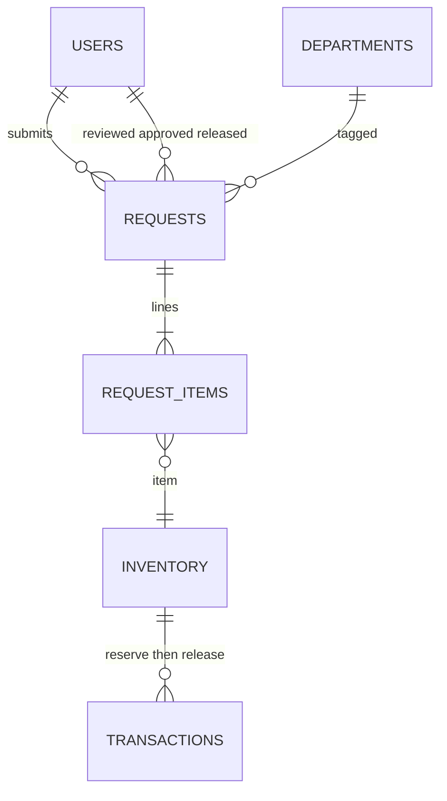
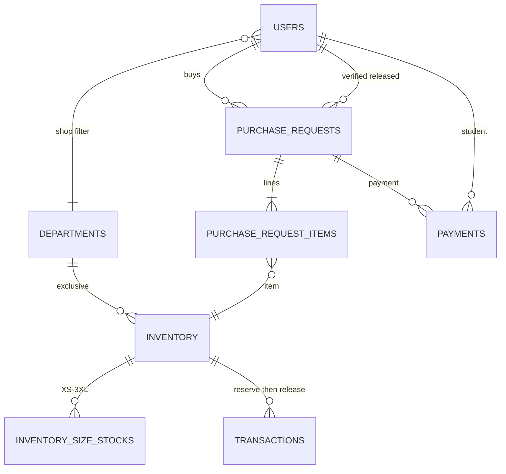

# PSIS Entity-Relationship Diagram

**System:** PECIT Smart Inventory System (PSIS)  
**Database:** `pecit_sis` (MySQL / MariaDB via XAMPP)  
**Source:** Laravel migrations under `database/migrations/`

This document is for project documentation. Render the Mermaid diagrams in GitHub, VS Code/Cursor Markdown preview, or [mermaid.live](https://mermaid.live).

There is **no `suppliers` table**. `supplier_id` was dropped from `inventory`. Uniform Shop exclusivity is modeled on `inventory.student_shop` + `inventory.department_id` (null = shared; set = department-exclusive).

**Available quantity is not a stored column.**

- Non-sized items: `available = inventory.quantity − inventory.reserved_quantity`
- Clothing uniforms in the shop: per-size rows on `inventory_size_stocks`; parent `inventory.quantity` / `reserved_quantity` are **sums** of those rows. Students see availability for the **chosen size** only.

Spatie roles include `Admission` (school owner: dashboard, inventory view, request approval).

---

## 1. High-level ER diagram (core domain)

```mermaid
erDiagram
    DEPARTMENTS ||--o{ USERS : "home department"
    DEPARTMENTS ||--o{ REQUESTS : "requesting dept"
    DEPARTMENTS ||--o{ INVENTORY : "exclusive shop item"

    USERS ||--o{ REQUESTS : "submits"
    USERS ||--o{ PURCHASE_REQUESTS : "buys"
    USERS ||--o{ PAYMENTS : "pays"
    USERS ||--o{ PSIS_NOTIFICATIONS : "receives"
    USERS ||--o{ ANNOUNCEMENTS : "creates"
    USERS ||--o{ AUDIT_LOGS : "performs"
    USERS ||--o{ TRANSACTIONS : "performs"
    USERS ||--o{ STOCK_LOGS : "performs"

    CATEGORIES ||--o{ INVENTORY : "classifies"

    REQUESTS ||--|{ REQUEST_ITEMS : "contains"
    INVENTORY ||--o{ REQUEST_ITEMS : "requested as"

    PURCHASE_REQUESTS ||--|{ PURCHASE_REQUEST_ITEMS : "contains"
    INVENTORY ||--o{ PURCHASE_REQUEST_ITEMS : "purchased as"
    PURCHASE_REQUESTS ||--o{ PAYMENTS : "paid via"

    INVENTORY ||--o{ INVENTORY_SIZE_STOCKS : "stock by size"
    INVENTORY ||--o{ TRANSACTIONS : "stock movement"
    INVENTORY ||--o{ STOCK_LOGS : "delivery log"

    ROLES ||--o{ MODEL_HAS_ROLES : "assigned"
    USERS ||--o{ MODEL_HAS_ROLES : "has role"
    PERMISSIONS ||--o{ MODEL_HAS_PERMISSIONS : "direct grant"
    USERS ||--o{ MODEL_HAS_PERMISSIONS : "has permission"
    PERMISSIONS ||--o{ ROLE_HAS_PERMISSIONS : "granted"
    ROLES ||--o{ ROLE_HAS_PERMISSIONS : "includes"

    DEPARTMENTS {
        bigint id PK
        string name
        string code UK
        text description
        boolean is_active
    }

    USERS {
        bigint id PK
        string employee_id UK "Student ID when Student"
        bigint department_id FK "nullable"
        string name
        string last_name "student login"
        string email UK
        string phone
        boolean is_active
        timestamp email_verified_at
        timestamp last_activity_at
        string password
    }

    CATEGORIES {
        bigint id PK
        string name
        string slug UK
        text description
        boolean is_active
    }

    INVENTORY {
        bigint id PK
        string item_code UK
        string item_name
        text description
        bigint category_id FK
        bigint department_id FK "null = shared shop"
        string unit
        decimal unit_price
        int quantity "on hand"
        int reserved_quantity
        int minimum_stock
        string location
        enum status
        boolean student_shop
        string barcode
    }

    INVENTORY_SIZE_STOCKS {
        bigint id PK
        bigint inventory_id FK
        string size UK "unique per item"
        int quantity "on hand for size"
        int reserved_quantity
    }

    REQUESTS {
        bigint id PK
        string request_number UK
        bigint user_id FK
        bigint department_id FK
        enum type "faculty or restock"
        enum status
        text purpose
        decimal total_amount
        bigint reviewed_by FK
        bigint approved_by FK
        bigint released_by FK
    }

    REQUEST_ITEMS {
        bigint id PK
        bigint request_id FK
        bigint inventory_id FK
        int quantity_requested
        int quantity_approved
        int quantity_released
        decimal unit_price
        decimal subtotal
    }

    PURCHASE_REQUESTS {
        bigint id PK
        string purchase_number UK
        bigint user_id FK
        enum status
        decimal total_amount
        bigint verified_by FK
        bigint released_by FK
    }

    PURCHASE_REQUEST_ITEMS {
        bigint id PK
        bigint purchase_request_id FK
        bigint inventory_id FK
        string size "nullable; required for clothing uniforms"
        int quantity
        decimal unit_price
        decimal subtotal
    }

    PAYMENTS {
        bigint id PK
        string reference_number UK
        bigint purchase_request_id FK
        bigint user_id FK
        decimal amount
        enum status
        string payment_method
        string receipt_path
        bigint verified_by FK
    }

    TRANSACTIONS {
        bigint id PK
        string transaction_number UK
        bigint inventory_id FK
        enum type
        int quantity
        int quantity_before
        int quantity_after
        string reference_type
        bigint reference_id
        bigint performed_by FK
    }

    STOCK_LOGS {
        bigint id PK
        bigint inventory_id FK
        enum action
        int quantity
        int balance_after
        string delivery_recipient
        bigint performed_by FK
    }

    PSIS_NOTIFICATIONS {
        bigint id PK
        bigint user_id FK
        string type
        string title
        text message
        string link
        boolean is_read
    }

    AUDIT_LOGS {
        bigint id PK
        bigint user_id FK
        string action
        string model_type
        bigint model_id
        json old_values
        json new_values
        string ip_address
    }

    ANNOUNCEMENTS {
        bigint id PK
        string title
        text content
        enum priority
        boolean is_active
        timestamp published_at
        timestamp expires_at
        bigint created_by FK
    }

    ROLES {
        bigint id PK
        string name
        string guard_name
    }

    PERMISSIONS {
        bigint id PK
        string name
        string guard_name
    }

    MODEL_HAS_ROLES {
        bigint role_id FK
        string model_type
        bigint model_id
    }

    MODEL_HAS_PERMISSIONS {
        bigint permission_id FK
        string model_type
        bigint model_id
    }

    ROLE_HAS_PERMISSIONS {
        bigint permission_id FK
        bigint role_id FK
    }
```

Optional actor FKs (all → `users.id`, `ON DELETE SET NULL` unless noted):

| Child | Columns |
|-------|---------|
| `requests` | `reviewed_by`, `approved_by`, `released_by` |
| `purchase_requests` | `verified_by`, `released_by` |
| `payments` | `verified_by` |
| `announcements` | `created_by` (`CASCADE`) |
| `transactions` / `stock_logs` | `performed_by` (`CASCADE`) |

---

## 2. Faculty request workflow (logical)

**Status path:**  
`pending` → Accounting review → `admin_review` → Admission or Administrator approve (stock **reserved**) → `approved` → Supply release (on-hand **deducted**, reserved cleared)

Cancel before release restores `reserved_quantity`. Submit does **not** deduct stock.

---

## 3. Student purchase / Uniform Shop (logical)

**Status path:**  
`pending` → `payment_submitted` → `payment_verified` (stock **reserved**) → `released` (on-hand **deducted**)

**Shop listing rules** (`Inventory::scopeForStudentShop`):

1. `student_shop = true`
2. `department_id` **null** → shared (P.E., NSTP, ID lanyard)
3. `department_id` **set** → only students whose `users.department_id` matches
4. Students never see another department’s exclusive uniform
5. Clothing uniforms require `purchase_request_items.size`; stock is reserved/released on that size. Accessories (e.g. ID lanyard) skip size.

Checkout and cart enforce the same checks. Students have **no** `/inventory` access.

---

## 4. Table summary

| Table | Purpose |
|-------|---------|
| `users` | Accounts (all roles). Students log in with `employee_id` + `last_name` |
| `departments` | Organizational units; also Uniform Shop exclusivity |
| `categories` | Inventory categories (includes Uniforms) |
| `inventory` | Stock: on hand, reserved, shop flag, optional exclusive department. For sized uniforms, totals are sums of size rows |
| `inventory_size_stocks` | Per-size on-hand and reserved qty (unique `inventory_id` + `size`). Clothing shop items only |
| `requests` | Faculty (and restock) supply requests |
| `request_items` | Lines on a faculty request (no size; faculty items are not sold by size) |
| `purchase_requests` | Student purchases |
| `purchase_request_items` | Lines on a student purchase; `size` required for clothing uniforms |
| `payments` | Student payment records / receipt path |
| `transactions` | Stock movement ledger (reserve / release / restore / adjust) |
| `stock_logs` | Delivery / stock-in action log |
| `psis_notifications` | In-app notifications (email via `NotificationService`) |
| `audit_logs` | Audit trail (polymorphic target) |
| `announcements` | Campus announcements |
| `roles` / `permissions` / pivots | Spatie RBAC (`Administrator`, `Admission`, `Accounting`, `Supply Personnel`, `Faculty`, `Student`) |

### Removed (do not document as current)

`suppliers` and `inventory.supplier_id` — dropped in `2026_08_06_000001_drop_suppliers_from_inventory.php`.

### Framework tables (not shown above)

`sessions`, `password_reset_tokens`, `cache`, `cache_locks`, `jobs`, `job_batches`, `failed_jobs` — Laravel infrastructure. `sessions.user_id` is indexed only (no FK).

### Polymorphic references (no physical FK)

- `transactions.reference_type` + `reference_id` → e.g. `SupplyRequest` or `PurchaseRequest`
- `audit_logs.model_type` + `model_id` → auditable model
- Spatie `model_has_roles` / `model_has_permissions`: `model_type` + `model_id` → `App\Models\User`

---

## 5. Cardinality notes

| Relationship | Cardinality | Notes |
|--------------|-------------|--------|
| Department → Users | 1:N (optional) | `users.department_id` nullable; `SET NULL` |
| Department → Inventory | 1:N (optional) | Exclusive shop items only; null = shared |
| Category → Inventory | 1:N | Required; `CASCADE` |
| User → Requests | 1:N | Faculty requester |
| Request → Request Items | 1:N | Identifying |
| Inventory → Request Items | 1:N | Faculty lines (no size column) |
| Inventory → Size stocks | 1:N | Unique per size; clothing uniforms |
| User → Purchase Requests | 1:N | Student buyer |
| Purchase Request → Items | 1:N | Identifying; optional `size` |
| Purchase Request → Payments | 1:N | |
| Inventory → Transactions | 1:N | Ledger |
| Inventory → Stock Logs | 1:N | |
| User → Roles (Spatie) | N:M | Via `model_has_roles` |
| Role → Permissions | N:M | Via `role_has_permissions` |

---

## 6. Export tips

- **GitHub / Cursor:** this file renders Mermaid automatically in Markdown preview  
- **PNG/SVG:** open [mermaid.live](https://mermaid.live), paste section 1, export  
- **Word/PDF:** export SVG/PNG from mermaid.live and insert into the report  
- **MySQL Workbench Reverse Engineer** often fails here because XAMPP ships **MariaDB**, not Oracle MySQL. Use this file (or mermaid.live) instead of Workbench for the ERD.

---

*Keep this file updated when migrations change. Last aligned with uniform size stocks (`inventory_size_stocks`), `purchase_request_items.size`, Admission role, and the suppliers drop.*
