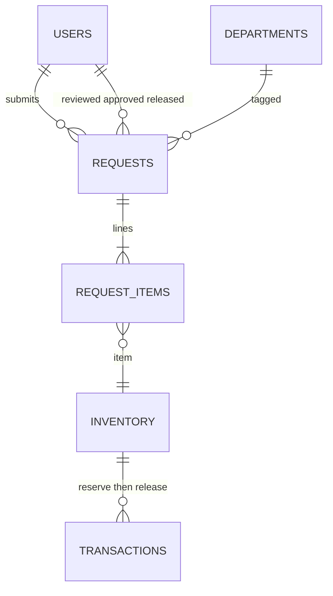
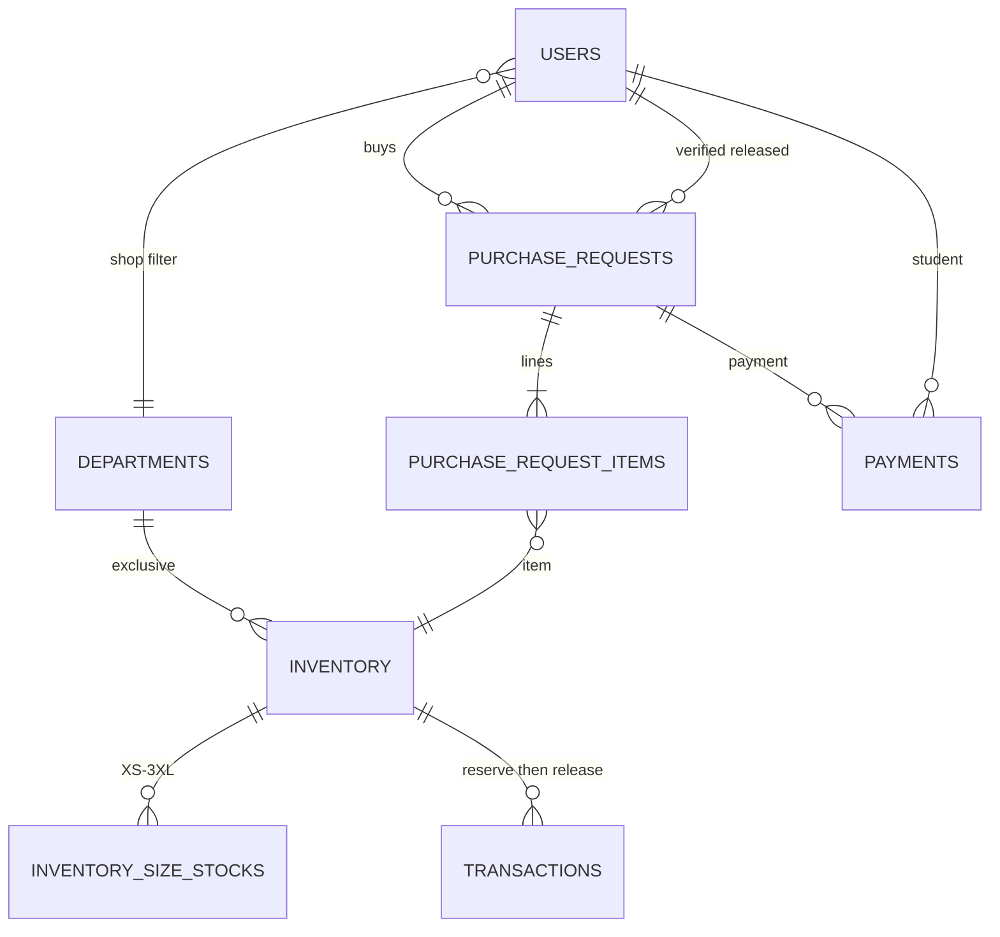
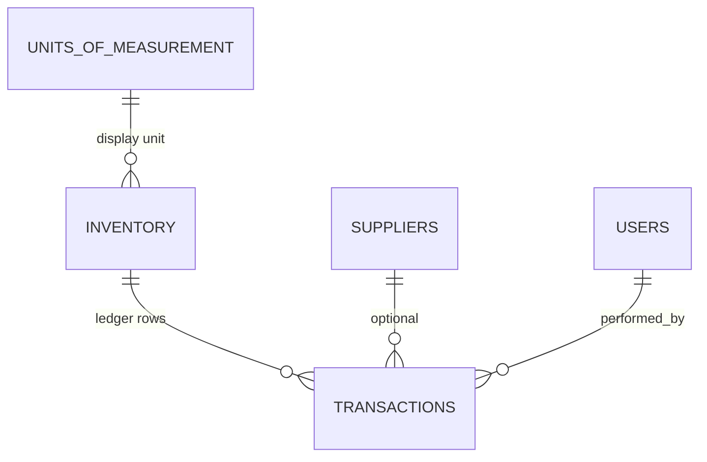

# PSIS Entity-Relationship Diagram

**System:** PECIT Smart Inventory System (PSIS)  
**Database:** `pecit_sis` (MySQL / MariaDB via XAMPP)  
**Source:** Laravel migrations under `database/migrations/` (including `2026_09_10_230000_add_stock_card_foundation.php` and `2026_09_10_233500_replace_academic_departments.php`)

This document is for project documentation. Render the Mermaid diagrams in GitHub, VS Code/Cursor Markdown preview, or [mermaid.live](https://mermaid.live).

There is **no `supplier_id` on the inventory item**. Supplier (when used) is recorded on the **stock movement** (`transactions.supplier_id`). One item can come from many suppliers, donations, or other sources. There is **no purchase-order document** and **no FIFO / moving-average costing engine**. A source labeled purchase order plus a typed PO or delivery-receipt number is receiving text on stock-in only.

Uniform Shop exclusivity is modeled on `inventory.student_shop` + `inventory.department_id` (null = shared; set = exclusive to that department’s students). There is **no barcode column** on `inventory`.

Canonical `departments.code` values: **CCS**, **CC**, **CTHM**, **CTE**, **CBA**, **SHS**, **ADMIN**, **SUPPLY**. Live remaps: CIT→CCS, COE→CC, COB→CBA.

**Available quantity is not a stored column.**

- Non-sized items: `available = inventory.quantity − inventory.reserved_quantity`
- Clothing uniforms in the shop: per-size rows on `inventory_size_stocks`; parent `inventory.quantity` / `reserved_quantity` are **sums** of those rows. Students see availability for the **chosen size** only.

**Stock Card** is a view of `transactions` where `type` is physical (`Transaction::scopePhysical()`). Types `reserve` and `restore` are logged for control and **hidden** on the card.

Spatie roles include `Admission` (school owner: dashboard, inventory view, Stock Card, request approval). Students have **no** `/inventory`.

---

## 1. High-level ER diagram (core domain)

```mermaid
erDiagram
    DEPARTMENTS ||--o{ USERS : "home department"
    DEPARTMENTS ||--o{ REQUESTS : "requesting dept"
    DEPARTMENTS ||--o{ INVENTORY : "exclusive shop item"

    UNITS_OF_MEASUREMENT ||--o{ INVENTORY : "UoM"
    CATEGORIES ||--o{ INVENTORY : "classifies"

    USERS ||--o{ REQUESTS : "submits"
    USERS ||--o{ PURCHASE_REQUESTS : "buys"
    USERS ||--o{ PAYMENTS : "pays"
    USERS ||--o{ PSIS_NOTIFICATIONS : "receives"
    USERS ||--o{ ANNOUNCEMENTS : "creates"
    USERS ||--o{ AUDIT_LOGS : "performs"
    USERS ||--o{ TRANSACTIONS : "performs"
    USERS ||--o{ STOCK_LOGS : "performs"
    USERS ||--o{ INVENTORY_PRICE_ADJUSTMENTS : "adjusts price"

    REQUESTS ||--|{ REQUEST_ITEMS : "contains"
    INVENTORY ||--o{ REQUEST_ITEMS : "requested as"

    PURCHASE_REQUESTS ||--|{ PURCHASE_REQUEST_ITEMS : "contains"
    INVENTORY ||--o{ PURCHASE_REQUEST_ITEMS : "purchased as"
    PURCHASE_REQUESTS ||--o{ PAYMENTS : "paid via"

    INVENTORY ||--o{ INVENTORY_SIZE_STOCKS : "stock by size"
    INVENTORY ||--o{ TRANSACTIONS : "stock ledger"
    INVENTORY ||--o{ STOCK_LOGS : "delivery log"
    INVENTORY ||--o{ INVENTORY_PRICE_ADJUSTMENTS : "selling price history"

    SUPPLIERS ||--o{ TRANSACTIONS : "optional on movement"

    ROLES ||--o{ MODEL_HAS_ROLES : "assigned"
    USERS ||--o{ MODEL_HAS_ROLES : "has role"
    PERMISSIONS ||--o{ MODEL_HAS_PERMISSIONS : "direct grant"
    USERS ||--o{ MODEL_HAS_PERMISSIONS : "has permission"
    PERMISSIONS ||--o{ ROLE_HAS_PERMISSIONS : "granted"
    ROLES ||--o{ ROLE_HAS_PERMISSIONS : "includes"

    DEPARTMENTS {
        bigint id PK
        string name
        string code UK "CCS CC CTHM CTE CBA SHS ADMIN SUPPLY"
        text description
        boolean is_active
    }

    USERS {
        bigint id PK
        string employee_id UK "Student ID when Student"
        bigint department_id FK "nullable"
        string name
        string last_name "student login"
        string email UK
        string phone
        boolean is_active
        timestamp email_verified_at
        timestamp last_activity_at
        string password
    }

    CATEGORIES {
        bigint id PK
        string name
        string slug UK
        text description
        boolean is_active
    }

    UNITS_OF_MEASUREMENT {
        bigint id PK
        string name
        string symbol UK
        string description
    }

    SUPPLIERS {
        bigint id PK
        string supplier_code UK
        string name
        string contact_person
        string phone
        string email
        text address
        boolean is_active
    }

    INVENTORY {
        bigint id PK
        string item_code UK
        string item_name
        text description
        bigint category_id FK
        bigint department_id FK "null = shared shop"
        string unit "legacy label"
        bigint unit_of_measurement_id FK "nullable"
        decimal unit_price "selling price"
        int quantity "on hand"
        int reserved_quantity
        int minimum_stock
        string location
        enum status
        boolean student_shop
    }

    INVENTORY_SIZE_STOCKS {
        bigint id PK
        bigint inventory_id FK
        string size UK "unique per item"
        int quantity "on hand for size"
        int reserved_quantity
    }

    INVENTORY_PRICE_ADJUSTMENTS {
        bigint id PK
        bigint inventory_id FK
        decimal old_unit_price
        decimal new_unit_price
        string reason
        bigint adjusted_by FK
        timestamp adjusted_at
    }

    REQUESTS {
        bigint id PK
        string request_number UK
        bigint user_id FK
        bigint department_id FK
        enum type "faculty or restock"
        enum status
        text purpose
        decimal total_amount
        bigint reviewed_by FK
        bigint approved_by FK
        bigint released_by FK
    }

    REQUEST_ITEMS {
        bigint id PK
        bigint request_id FK
        bigint inventory_id FK
        int quantity_requested
        int quantity_approved
        int quantity_released
        decimal unit_price
        decimal subtotal
    }

    PURCHASE_REQUESTS {
        bigint id PK
        string purchase_number UK
        bigint user_id FK
        enum status
        decimal total_amount
        bigint verified_by FK
        bigint released_by FK
    }

    PURCHASE_REQUEST_ITEMS {
        bigint id PK
        bigint purchase_request_id FK
        bigint inventory_id FK
        string size "nullable; required for clothing"
        int quantity
        decimal unit_price
        decimal subtotal
    }

    PAYMENTS {
        bigint id PK
        string reference_number UK
        bigint purchase_request_id FK
        bigint user_id FK
        decimal amount
        enum status
        string payment_method
        string receipt_path
        bigint verified_by FK
    }

    TRANSACTIONS {
        bigint id PK
        string transaction_number UK
        bigint inventory_id FK
        string type "varchar 40"
        string source_type "nullable"
        int quantity
        int quantity_in
        int quantity_out
        int quantity_before
        int quantity_after
        int balance_after
        decimal unit_cost "optional delivery cost"
        decimal total_cost
        bigint supplier_id FK "nullable"
        string reference_type
        bigint reference_id
        string reference_number "PO text"
        string delivery_receipt_number
        string size
        timestamp transaction_date
        bigint performed_by FK
    }

    STOCK_LOGS {
        bigint id PK
        bigint inventory_id FK
        enum action
        int quantity
        int balance_after
        string delivery_recipient
        bigint performed_by FK
    }

    PSIS_NOTIFICATIONS {
        bigint id PK
        bigint user_id FK
        string type
        string title
        text message
        string link
        boolean is_read
    }

    AUDIT_LOGS {
        bigint id PK
        bigint user_id FK
        string action
        string model_type
        bigint model_id
        json old_values
        json new_values
        string ip_address
    }

    ANNOUNCEMENTS {
        bigint id PK
        string title
        text content
        enum priority
        boolean is_active
        timestamp published_at
        timestamp expires_at
        bigint created_by FK
    }

    ROLES {
        bigint id PK
        string name
        string guard_name
    }

    PERMISSIONS {
        bigint id PK
        string name
        string guard_name
    }

    MODEL_HAS_ROLES {
        bigint role_id FK
        string model_type
        bigint model_id
    }

    MODEL_HAS_PERMISSIONS {
        bigint permission_id FK
        string model_type
        bigint model_id
    }

    ROLE_HAS_PERMISSIONS {
        bigint permission_id FK
        bigint role_id FK
    }
```

Optional actor FKs (all → `users.id`, `ON DELETE SET NULL` unless noted):

| Child | Columns |
|-------|---------|
| `requests` | `reviewed_by`, `approved_by`, `released_by` |
| `purchase_requests` | `verified_by`, `released_by` |
| `payments` | `verified_by` |
| `announcements` | `created_by` (`CASCADE`) |
| `transactions` / `stock_logs` | `performed_by` (`CASCADE`) |
| `inventory_price_adjustments` | `adjusted_by` (`CASCADE`) |
| `inventory` | `unit_of_measurement_id` (`SET NULL`) |
| `transactions` | `supplier_id` (`SET NULL`) |

---

## 2. Faculty request workflow (logical)

**Status path:**  
`pending` → Accounting review → `admin_review` → Admission or Administrator approve (stock **reserved**) → `approved` → Supply release (on-hand **deducted**, reserved cleared)

Submit does **not** deduct stock. Faculty may cancel through `admin_review` and `approved` (before release). Cancelling an **approved** request **restores** `reserved_quantity`.

---

## 3. Student purchase / Uniform Shop (logical)

**Status path:**  
`pending` → `payment_submitted` → `payment_verified` (stock **reserved**) → `released` (on-hand **deducted**)

Students may **cancel until Supply releases** (before or after Accounting verifies). Cancel after `payment_verified` **restores** reserved quantity, including the chosen size.

**Shop listing rules** (`Inventory::scopeForStudentShop`):

1. `student_shop = true` and status is not `discontinued`
2. `department_id` **null** → shared (P.E., NSTP, ID lanyard)
3. `department_id` **set** → only students whose `users.department_id` matches (CCS, CC, CTHM, CTE, CBA, or SHS exclusive uniforms)
4. Students never see another department’s exclusive uniform (e.g. CCS students never see the CC exclusive)
5. Clothing uniforms require `purchase_request_items.size`; stock is reserved/released on that size. Accessories (e.g. ID lanyard) skip size.

Checkout and cart enforce the same checks. Students have **no** `/inventory` access.

---

## 3a. Canonical departments

| Code | Name | Typical shop use |
|------|------|------------------|
| `CCS` | College of Computer Studies | Exclusive uniforms |
| `CC` | College of Criminology | Exclusive uniforms |
| `CTHM` | College of Tourism and Hospitality Management | Exclusive uniforms |
| `CTE` | College of Teacher Education | Exclusive uniforms |
| `CBA` | College of Business Administration | Exclusive uniforms |
| `SHS` | Senior High School | Exclusive uniforms |
| `ADMIN` | Administration | Staff home department |
| `SUPPLY` | Supply Office | Staff home department |

Seeded exclusive item codes: `UNI-CCS`, `UNI-CC`, `UNI-CTHM`, `UNI-CTE`, `UNI-CBA`, `UNI-SHS`. Shared shop items leave `department_id` null (`UNI-PE`, `UNI-NSTP`, `UNI-LANYARD`).

---

## 3b. Stock Card / ledger (logical)

`InventoryService` writes `transactions` for stock-in, stock-out, adjustment, damage, bad order, return to supplier, reserve, release, and restore.

| Type | Physical on Stock Card? | On-hand | Reserved |
|------|-------------------------|---------|----------|
| `stock_in`, `opening_balance`, `purchase_delivery` | Yes (in) | ↑ | unchanged |
| `stock_out`, `damage`, `bad_order`, `return_to_supplier` | Yes (out) | ↓ | unchanged |
| `release` | Yes (out) | ↓ | ↓ |
| `adjustment` / `adjustment_in` / `adjustment_out` | Yes | ± | unchanged |
| `reserve` | Hidden | unchanged | ↑ |
| `restore` | Hidden | unchanged | ↓ |

Stock-in **source_type** values used on the form: `manual_external`, `purchase_order` (requires supplier + reference number), `emergency_purchase` (requires reference), `donation`, `opening_balance`, `other`. `unit_cost` is optional history; it does not overwrite selling `unit_price` and does not compute a moving average.

Stock Card UI (`inventory.stock-card`): Admin, Admission, Accounting, Supply Personnel. Faculty may view inventory lists but **not** the card. Filters: date range, physical type, supplier, reference / DR / transaction number.

---

## 4. Table summary

| Table | Purpose |
|-------|---------|
| `users` | Accounts (all roles). Students log in with `employee_id` + `last_name` |
| `departments` | Organizational units (CCS, CC, CTHM, CTE, CBA, SHS, ADMIN, SUPPLY) and Uniform Shop exclusivity |
| `categories` | Inventory categories (includes Uniforms) |
| `units_of_measurement` | UoM master (`symbol` unique). Linked from `inventory.unit_of_measurement_id` |
| `suppliers` | Vendor master. Linked from `transactions.supplier_id`, not from the item |
| `inventory` | Stock: on hand, reserved, shop flag, optional exclusive department, selling price. Sized uniforms: totals are sums of size rows |
| `inventory_size_stocks` | Per-size on-hand and reserved qty (unique `inventory_id` + `size`). Clothing shop items only |
| `inventory_price_adjustments` | History when selling `unit_price` changes |
| `requests` | Faculty (and restock) supply requests |
| `request_items` | Lines on a faculty request (no size; faculty items are not sold by size) |
| `purchase_requests` | Student purchases (not vendor POs) |
| `purchase_request_items` | Lines on a student purchase; `size` required for clothing uniforms |
| `payments` | Student payment records / receipt path |
| `transactions` | Stock movement ledger / Stock Card source |
| `stock_logs` | Delivery / stock-in action log |
| `psis_notifications` | In-app notifications (email via `NotificationService`) |
| `audit_logs` | Audit trail (polymorphic target) |
| `announcements` | Campus announcements |
| `roles` / `permissions` / pivots | Spatie RBAC (`Administrator`, `Admission`, `Accounting`, `Supply Personnel`, `Faculty`, `Student`) |

### Note on suppliers and barcode

`inventory.supplier_id` was dropped from the item master (`2026_08_06_000001_drop_suppliers_from_inventory.php`). The **Suppliers** module was restored as movement-level data (`suppliers` + `transactions.supplier_id`, migration `2026_09_10_230000_add_stock_card_foundation.php`). The unused `barcode` column was removed from `inventory`.

### Framework tables (not shown above)

`sessions`, `password_reset_tokens`, `cache`, `cache_locks`, `jobs`, `job_batches`, `failed_jobs` — Laravel infrastructure. `sessions.user_id` is indexed only (no FK).

### Polymorphic references (no physical FK)

- `transactions.reference_type` + `reference_id` → e.g. `SupplyRequest` or `PurchaseRequest`
- `audit_logs.model_type` + `model_id` → auditable model
- Spatie `model_has_roles` / `model_has_permissions`: `model_type` + `model_id` → `App\Models\User`

---

## 5. Cardinality notes

| Relationship | Cardinality | Notes |
|--------------|-------------|--------|
| Department → Users | 1:N (optional) | `users.department_id` nullable; `SET NULL` |
| Department → Inventory | 1:N (optional) | Exclusive shop items only; null = shared (P.E. / NSTP / lanyard) |
| Category → Inventory | 1:N | Required; `CASCADE` |
| Unit of measurement → Inventory | 1:N (optional) | `unit_of_measurement_id`; `SET NULL` |
| Supplier → Transactions | 1:N (optional) | Required when stock-in source is purchase order |
| User → Requests | 1:N | Faculty requester |
| Request → Request Items | 1:N | Identifying |
| Inventory → Request Items | 1:N | Faculty lines (no size column) |
| Inventory → Size stocks | 1:N | Unique per size; clothing uniforms |
| Inventory → Price adjustments | 1:N | Selling-price history |
| User → Purchase Requests | 1:N | Student buyer |
| Purchase Request → Items | 1:N | Identifying; optional `size` |
| Purchase Request → Payments | 1:N | |
| Inventory → Transactions | 1:N | Ledger / Stock Card |
| Inventory → Stock Logs | 1:N | |
| User → Roles (Spatie) | N:M | Via `model_has_roles` |
| Role → Permissions | N:M | Via `role_has_permissions` |

---

## 6. Export tips

- **GitHub / Cursor:** this file renders Mermaid automatically in Markdown preview  
- **PNG/SVG:** open [mermaid.live](https://mermaid.live), paste section 1, export  
- **Word/PDF:** export SVG/PNG from mermaid.live and insert into the report  
- **MySQL Workbench Reverse Engineer** often fails here because XAMPP ships **MariaDB**, not Oracle MySQL. Use this file (or mermaid.live) instead of Workbench for the ERD.

---

*Keep this file updated when migrations change. Last aligned 11 September 2026 with academic departments (CCS, CC, CTHM, CTE, CBA, SHS, ADMIN, SUPPLY), `units_of_measurement`, `suppliers` on movements, `inventory_price_adjustments`, extended `transactions` (Stock Card), uniform size stocks, Admission role, and no barcode / no item-level supplier / no FIFO or PO module.*
