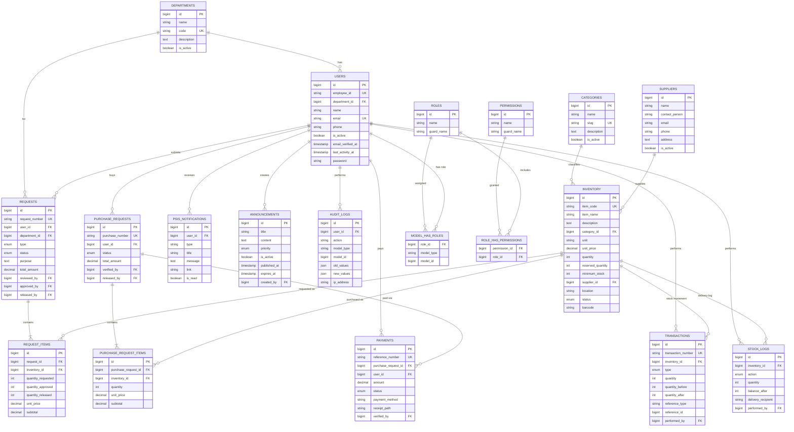
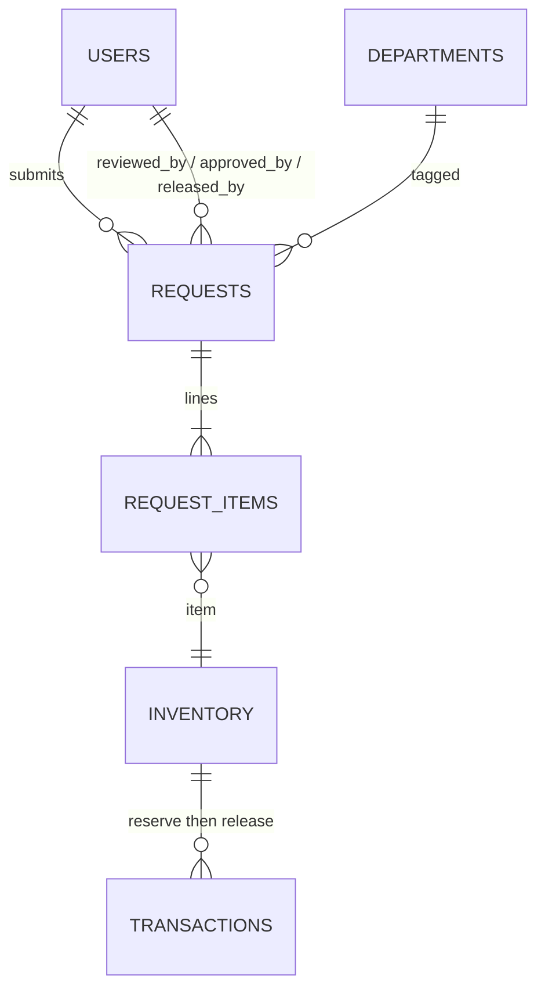
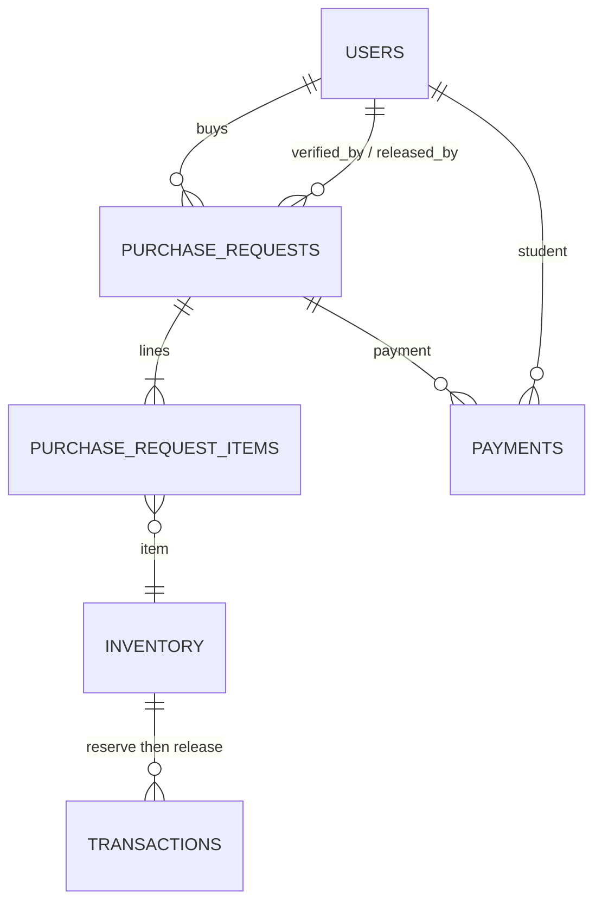

# PSIS Entity-Relationship Diagram

**System:** PECIT Smart Inventory System (PSIS)  
**Database:** `pecit_sis` (MySQL)  
**Source:** Laravel migrations under `database/migrations/`

This document is for project documentation. Render the Mermaid diagrams in GitHub, VS Code/Cursor Markdown preview, or [mermaid.live](https://mermaid.live).

---

## 1. High-level ER diagram (core domain)

---

## 2. Faculty request workflow (logical)

**Status path:**  
`pending` → `accounting_review` / `admin_review` → `approved` (stock reserved) → `released` (stock deducted)

---

## 3. Student purchase workflow (logical)

**Status path:**  
`pending` → `payment_submitted` → `payment_verified` (stock reserved) → `released` (stock deducted)

---

## 4. Table summary

| Table | Purpose |
|-------|---------|
| `users` | Accounts (faculty, student, staff, admin) |
| `departments` | Organizational units |
| `categories` | Inventory categories |
| `suppliers` | Item suppliers |
| `inventory` | Stock items (on hand + reserved) |
| `requests` | Faculty (and restock) supply requests |
| `request_items` | Lines on a faculty request |
| `purchase_requests` | Student purchases |
| `purchase_request_items` | Lines on a student purchase |
| `payments` | Student payment records / receipts |
| `transactions` | Stock movement ledger |
| `stock_logs` | Delivery / stock action log |
| `psis_notifications` | In-app notifications |
| `audit_logs` | Audit trail (polymorphic target) |
| `announcements` | Campus announcements |
| `roles` / `permissions` / pivots | Spatie RBAC |

### Framework tables (not shown above)

`sessions`, `password_reset_tokens`, `cache`, `jobs`, `failed_jobs` — Laravel infrastructure.

### Polymorphic references

- `transactions.reference_type` + `reference_id` → e.g. `SupplyRequest` or `PurchaseRequest`
- `audit_logs.model_type` + `model_id` → auditable model

---

## 5. Cardinality notes

| Relationship | Cardinality |
|--------------|-------------|
| Department → Users | 1:N |
| Category → Inventory | 1:N |
| Supplier → Inventory | 1:N (nullable) |
| User → Requests | 1:N |
| Request → Request Items | 1:N |
| Inventory → Request Items | 1:N |
| User → Purchase Requests | 1:N |
| Purchase Request → Items | 1:N |
| Purchase Request → Payments | 1:N |
| Inventory → Transactions | 1:N |
| User → Roles (via Spatie) | N:M |

---

## 6. Export tips

- **GitHub:** paste Mermaid into a `.md` file (this file) — GitHub renders it automatically  
- **PNG/SVG:** open [mermaid.live](https://mermaid.live), paste section 1, export  
- **Word/PDF docs:** export SVG/PNG from mermaid.live and insert into your report  

---

*Generated for PSIS documentation. Keep this file updated when migrations change.*
