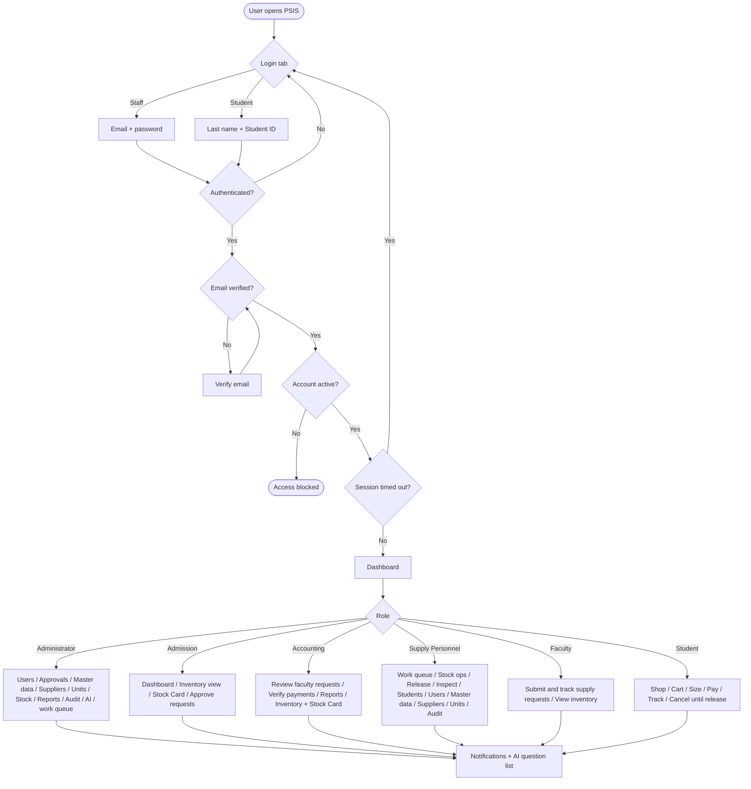
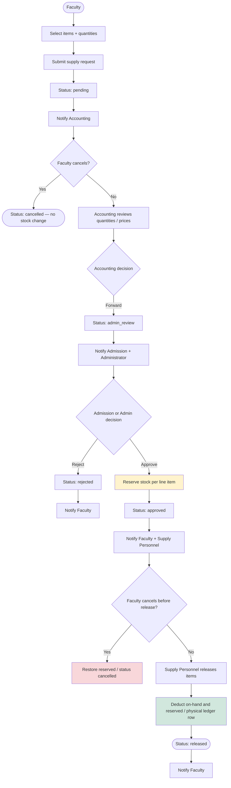
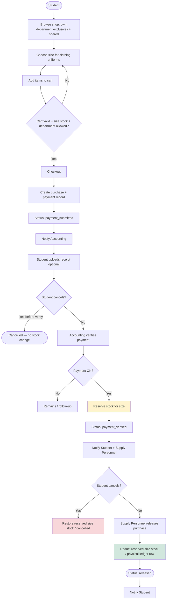
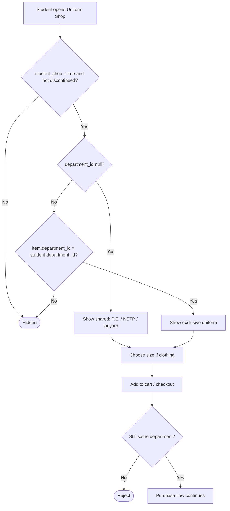
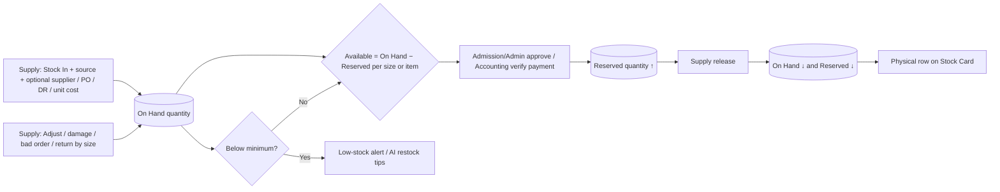
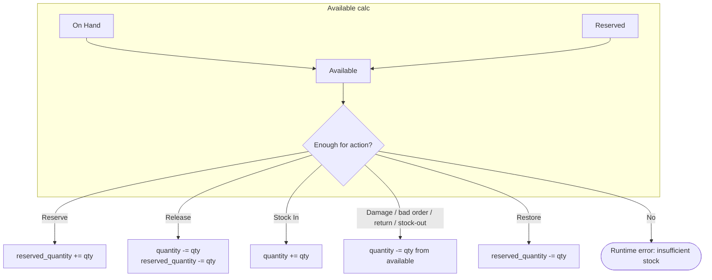
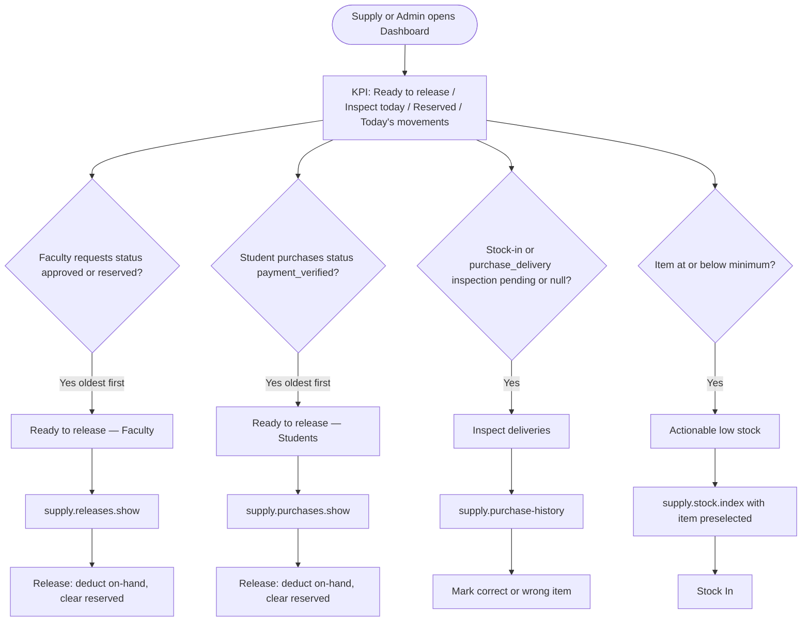
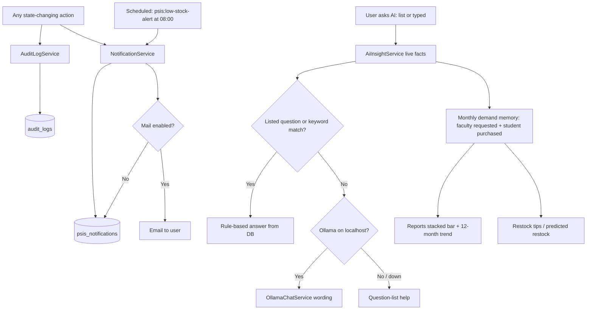
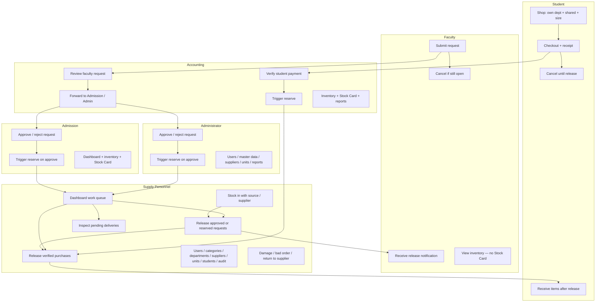

# PSIS System Flowcharts

**System:** PECIT Smart Inventory System (PSIS)  
**Purpose:** Documentation of end-to-end process flows by role and module  

Render Mermaid diagrams in GitHub, Cursor/VS Code Markdown preview, or [mermaid.live](https://mermaid.live) (export PNG/SVG for reports).

Related: [`ER-DIAGRAM.md`](ER-DIAGRAM.md)

There is **no public self-registration**. Staff use email + password; students use last name + Student ID. AI chat uses live data (`AiInsightService`); listed questions are rule-based and optional **local Ollama** (`OllamaChatService`, localhost only) can word free-typed answers. It is not a cloud LLM. Stock Card shows **physical** `transactions` only (reserve/restore hidden). Supplier and optional unit cost live on the **movement**, not on the item. Typed PO / DR numbers on stock-in are receiving text, not a purchase-order module.

---

## 1. System overview (login → role dashboards)

Students never receive an Inventory or Stock Card menu. Faculty can view inventory but cannot open the Stock Card or change stock. **Pending Requests** on the dashboard is Accounting / Admin / Faculty work; Supply’s queue is ready-to-release + inspect (see §4a).

---

## 2. Faculty supply request workflow

**Stock rule:** Submit does **not** deduct stock. **Approve** reserves. **Release** deducts. **Cancel after approve** restores reserved.

| Status | Actor | Stock effect |
|--------|--------|--------------|
| `pending` | Faculty | None |
| `accounting_review` / `admin_review` | Accounting → Admission / Admin | None |
| `approved` | Admission or Administrator | Reserve (`transactions.type = reserve`, hidden on Stock Card) |
| `released` | Supply Personnel | Deduct on-hand and reserved (`type = release`, shown on card) |
| `cancelled` while pending / admin_review | Faculty | None |
| `cancelled` while approved | Faculty (or Admin) | Restore reserved (`type = restore`, hidden on card) |
| `rejected` | Admission / Admin | None |

---

## 3. Student purchase workflow

| Status | Actor | Stock effect |
|--------|--------|--------------|
| `pending` → `payment_submitted` | Student checkout | None |
| `payment_verified` | Accounting | Reserve (per size when clothing) |
| `released` | Supply Personnel | Deduct |
| `cancelled` before verify | Student | None |
| `cancelled` after verify | Student / Accounting / Admin | Restore reserved (including size) |

**Shop listing:** students only see items with `student_shop = true` that are either **shared** (`department_id` null: P.E., NSTP, lanyard) or **exclusive to their department** (CCS, CC, CTHM, CTE, CBA, or SHS). Other departments’ exclusives are hidden; cart and checkout reject them. Discontinued items are hidden.

---

## 4. Inventory stock lifecycle and Stock Card

**Stock-in sources** (`StockSourceType` on the form): Manual / external, Purchase order (supplier + PO number **required**), Emergency purchase (reference **required**), Donation, Opening balance, Other. Purchase-order source is **not** a PO module.

**Stock Card** (`StockCardService`): reads `transactions` with physical types only; filters by date, type, supplier, and reference. Admin, Admission, Accounting, and Supply may open it. Faculty cannot.

---

## 4a. Supply / Admin dashboard work queue

Not a table — a **view** of live rows Supply must act on. Faculty, Accounting, Admission, and Student dashboards do **not** show this block. Administrator keeps **Pending Requests** / **Approved** KPI cards **and** this queue.

| Queue | Source | Status / filter | Next screen |
|-------|--------|-----------------|-------------|
| Faculty ready | `requests` | `approved` or `reserved` | Release Items |
| Student ready | `purchase_requests` | `payment_verified` | Student Purchases |
| Inspect today | `transactions` (stock-in / purchase delivery) | `inspection_status` pending or null | Purchase History |
| Low stock | `inventory` | available ≤ minimum | Stock Operations (`?item=`) |

Pending faculty requests (`pending` / `accounting_review` / `admin_review`) stay with Accounting then Admission/Admin. They are **not** Supply’s dashboard queue.

---

## 5. Cross-cutting support flows

Audit logs record logins, inventory/stock, users, master data, and profile changes.

---

## 6. Administrator, Admission, and Supply master data

```mermaid
flowchart TD
    A([Administrator]) --> B[Manage users + roles]
    A --> C[Departments / Categories]
    A --> SUP[Suppliers]
    A --> UOM[Units of measurement]
    A --> D[Announcements]
    A --> E[Approve / reject faculty requests]
    A --> F[View audit logs]
    A --> G[Reports PDF / Excel / issuance log / most-requested]
    A --> H[AI restock insights]
    A --> SC[Stock Card / stock operations]
    A --> WQ[Dashboard work queue]

    AD([Admission]) --> E
    AD --> IV[View inventory + Stock Card + dashboard]

    SP([Supply Personnel]) --> B
    SP --> C
    SP --> SUP
    SP --> UOM
    SP --> D
    SP --> F
    SP --> ST[Students add / CSV]
    SP --> SK[Stock in / out / damage / return by size]
    SP --> SC
    SP --> WQ
    SP --> PH[Purchase History inspect]

    B --> I[(users + Spatie roles)]
    C --> J[(master tables → inventory)]
    SUP --> TXN[(transactions.supplier_id)]
    UOM --> INV[(inventory.unit_of_measurement_id)]
    D --> K[Shown on dashboards]
    E --> L[See Faculty workflow]
    F --> M[(audit_logs)]
    G --> N[Operational decisions]
    SK --> SZ[(inventory_size_stocks + transactions)]
```

**Canonical departments:** CCS, CC, CTHM, CTE, CBA, SHS, ADMIN, SUPPLY. Academic codes drive Uniform Shop exclusivity; ADMIN and SUPPLY are staff home departments. CSV import `department_code` uses CCS, CC, CTHM, CTE, CBA, SHS.

---

## 7. Swimlane summary (who does what)

---

## 8. Export tips

- Paste any diagram into [mermaid.live](https://mermaid.live) → **Export PNG/SVG** for Word/PDF chapters  
- GitHub renders Mermaid in Markdown automatically after push  
- For thesis/docs, use **§2 Faculty** and **§3 Student** as the two primary process chapters; use **§1** as the system context diagram; use **§4** for Stock Card / stock-in sources; use **§4a** for the Supply dashboard work queue  

---

*Keep this file aligned with `SupplyRequestService`, `PurchaseRequestService`, `InventoryService`, `StockCardService`, `AiInsightService`, `OllamaChatService`, `DashboardController` (Supply/Admin work queue), and the canonical departments (CCS, CC, CTHM, CTE, CBA, SHS, ADMIN, SUPPLY) when workflows change. Last aligned 28 September 2026.*
