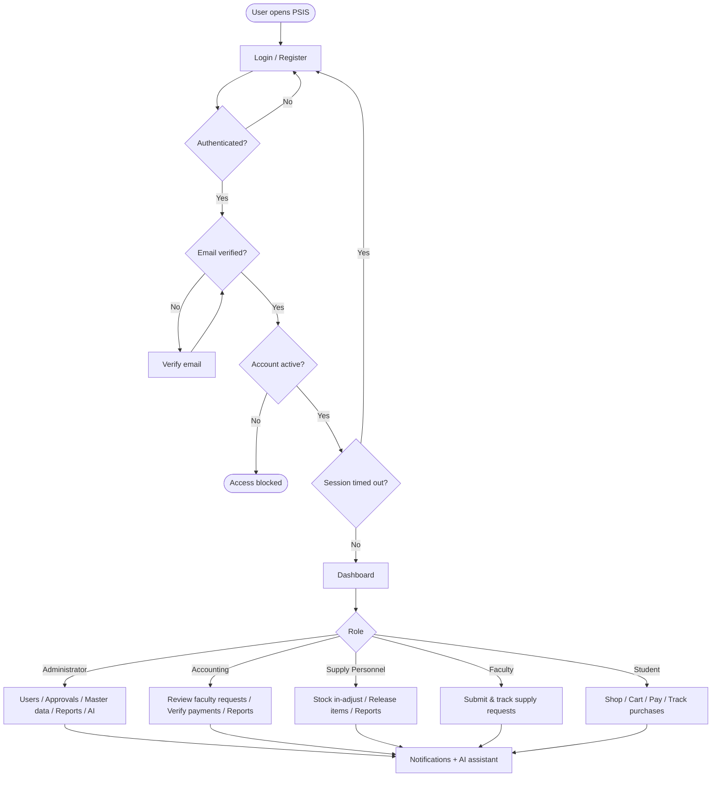
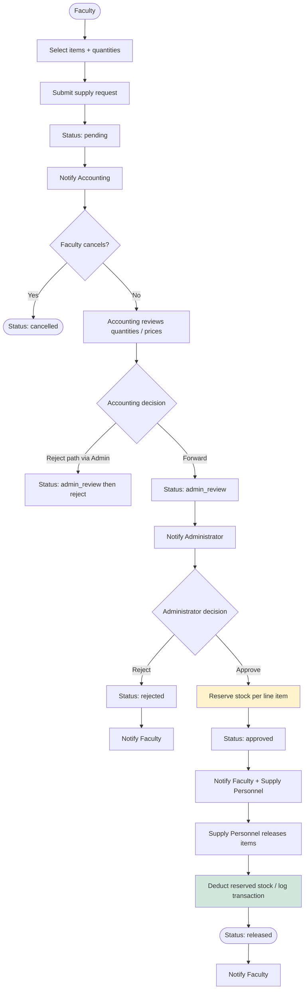
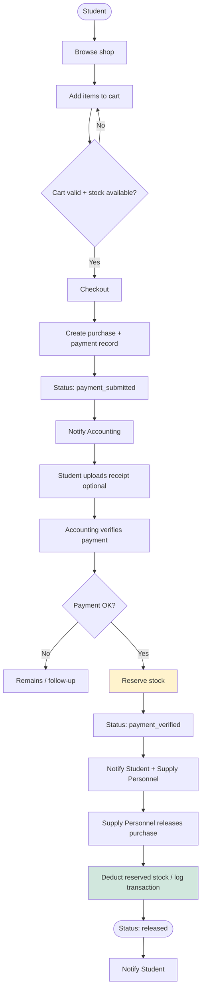
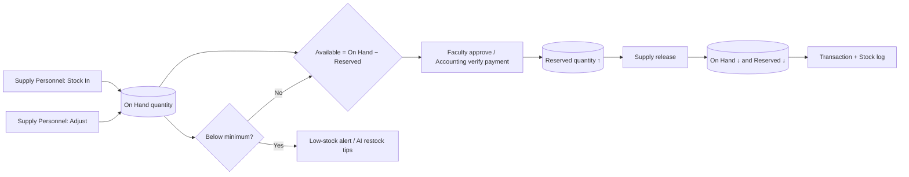
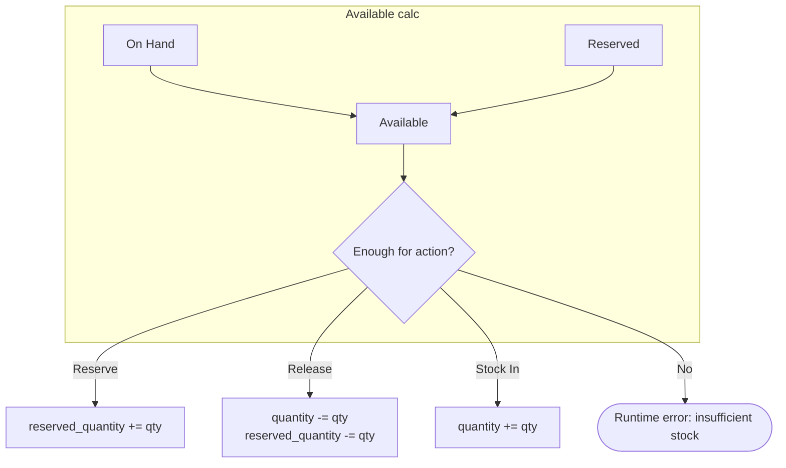
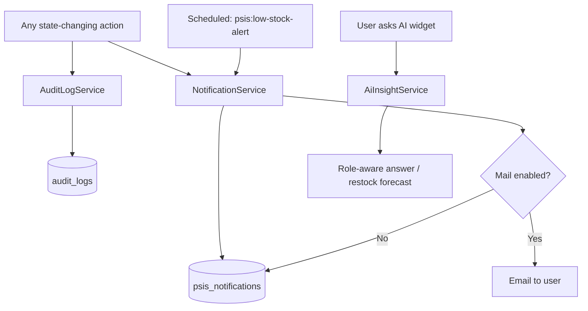
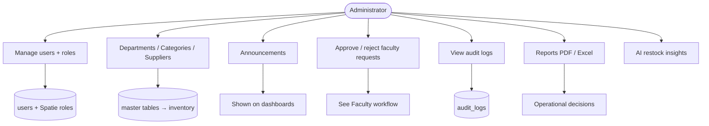
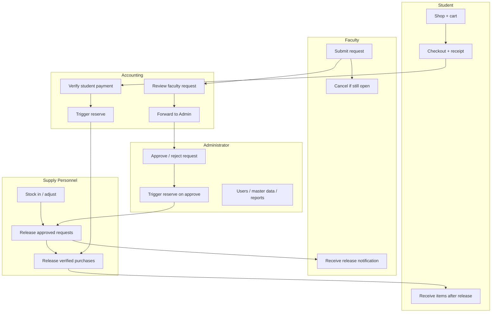

# PSIS System Flowcharts

**System:** PECIT Smart Inventory System (PSIS)  
**Purpose:** Documentation of end-to-end process flows by role and module  

Render Mermaid diagrams in GitHub, Cursor/VS Code Markdown preview, or [mermaid.live](https://mermaid.live) (export PNG/SVG for reports).

Related: [`ER-DIAGRAM.md`](ER-DIAGRAM.md)

---

## 1. System overview (login → role dashboards)

---

## 2. Faculty supply request workflow

**Stock rule:** Submit does **not** deduct stock. **Approve** reserves. **Release** deducts.

| Status | Actor | Stock effect |
|--------|--------|--------------|
| `pending` | Faculty | None |
| `accounting_review` / `admin_review` | Accounting → Admin | None |
| `approved` | Administrator | Reserve |
| `released` | Supply Personnel | Deduct (from reserved) |
| `rejected` / `cancelled` | Admin / Faculty | None |

---

## 3. Student purchase workflow

| Status | Actor | Stock effect |
|--------|--------|--------------|
| `pending` → `payment_submitted` | Student checkout | None |
| `payment_verified` | Accounting | Reserve |
| `released` | Supply Personnel | Deduct |
| `cancelled` | Allowed actors | Release reservation if any |

---

## 4. Inventory stock lifecycle

---

## 5. Cross-cutting support flows

---

## 6. Administrator master-data & oversight

---

## 7. Swimlane summary (who does what)

---

## 8. Export tips

- Paste any diagram into [mermaid.live](https://mermaid.live) → **Export PNG/SVG** for Word/PDF chapters  
- GitHub renders Mermaid in Markdown automatically after push  
- For thesis/docs, use **§2 Faculty** and **§3 Student** as the two primary process chapters; use **§1** as the system context diagram  

---

*Keep this file aligned with `SupplyRequestService`, `PurchaseRequestService`, and `InventoryService` when workflows change.*
